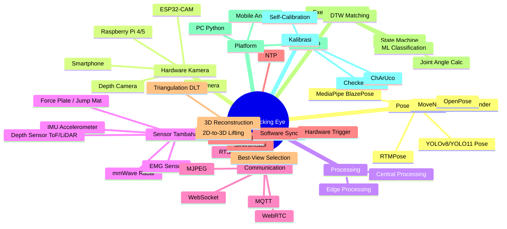
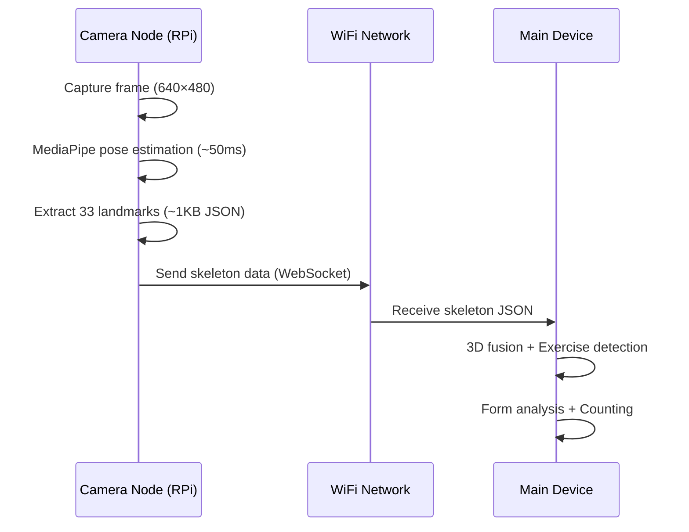
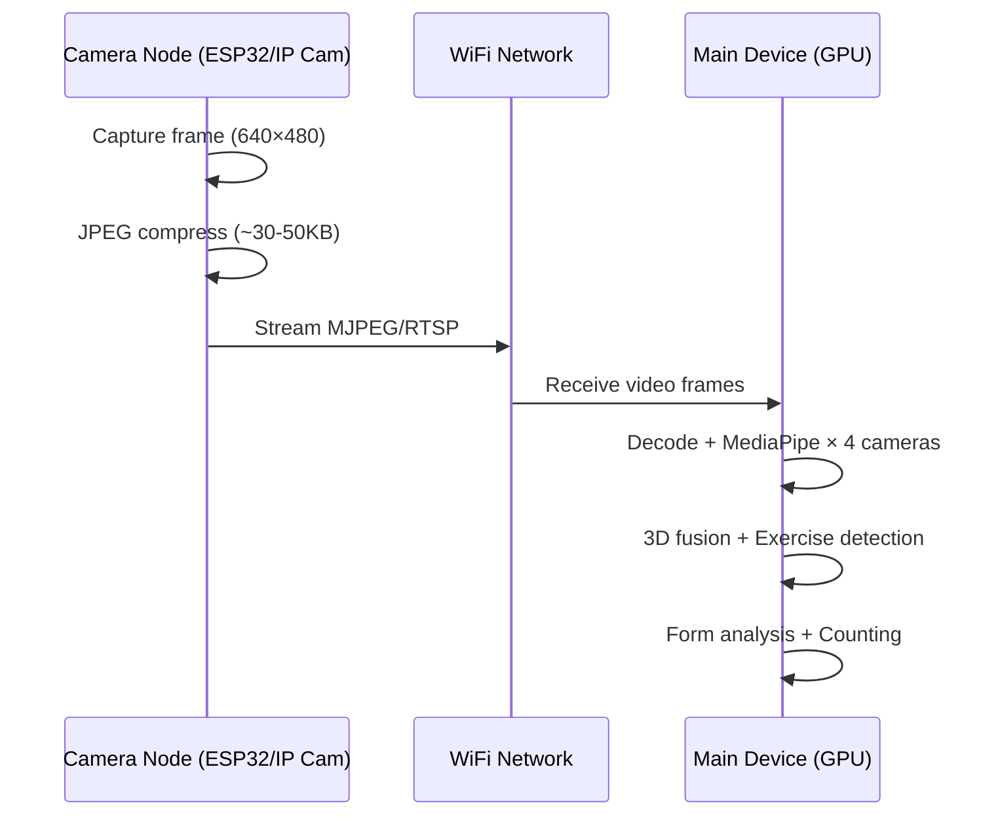

# 📄 Fitness Tracking Eye — Comprehensive Analysis Paper

> **Dokumen Riset Mendalam v2.0**
> Tanggal: 1 September 2026
> Tujuan: Menyediakan analisis mendalam seluruh opsi teknologi pada setiap pilar proyek sebagai dasar diskusi dan pengambilan keputusan sebelum implementasi.

---

## Daftar Isi

1. [Executive Summary](#1-executive-summary)
2. [Pilar 1: Pose Estimation Engine](#2-pilar-1-pose-estimation-engine)
3. [Pilar 2: Hardware Kamera](#3-pilar-2-hardware-kamera)
4. [Pilar 3: Processing Strategy](#4-pilar-3-processing-strategy)
5. [Pilar 4: Sensor Pendukung](#5-pilar-4-sensor-pendukung)
6. [Pilar 5: Communication Protocol](#6-pilar-5-communication-protocol)
7. [Pilar 6: Sinkronisasi Multi-Kamera](#7-pilar-6-sinkronisasi-multi-kamera)
8. [Pilar 7: 3D Reconstruction Method](#8-pilar-7-3d-reconstruction-method)
9. [Pilar 8: Exercise Detection Algorithm](#9-pilar-8-exercise-detection-algorithm)
10. [Pilar 9: Platform & UI](#10-pilar-9-platform--ui)
11. [Pilar 10: Kalibrasi Kamera](#11-pilar-10-kalibrasi-kamera)
12. [Analisis Produk Komersial Existing](#12-analisis-produk-komersial-existing)
13. [Risk Matrix & Tantangan Teknis](#13-risk-matrix--tantangan-teknis)
14. [Referensi Akademik & Resources](#14-referensi-akademik--resources)
15. [Ringkasan Keputusan yang Perlu Diambil](#15-ringkasan-keputusan-yang-perlu-diambil)

---

## 1. Executive Summary

Proyek **Fitness Tracking Eye** bertujuan membangun sistem pelacakan fitness menggunakan motion capture dengan multiple wireless camera terintegrasi. Sistem ini harus mampu mendeteksi, menghitung repetisi, dan menganalisis form dari 5 exercise: **Push Up, Pull Up, Sit Up, Squat Jump, dan Vertical Jump**.

Dokumen ini menganalisis **10 pilar teknologi** yang masing-masing memiliki beberapa opsi. Setiap opsi dievaluasi berdasarkan: **akurasi, biaya, kompleksitas implementasi, scalability, dan kesesuaian** dengan kebutuhan proyek.

### Landscape Teknologi



---

## 2. Pilar 1: Pose Estimation Engine

Pose estimation adalah **jantung** dari sistem ini. Engine inilah yang menentukan seberapa akurat kita bisa mendeteksi posisi sendi tubuh dari video kamera.

### 2.1 Perbandingan Mendalam 5 Engine

#### A. MediaPipe BlazePose (Google)

| Aspek | Detail |
|:---|:---|
| **Arsitektur** | Two-stage: detector (BlazeFace-inspired) → landmark model |
| **Keypoints** | **33 keypoints 3D** (termasuk jari tangan & kaki) |
| **Kecepatan** | 30+ FPS pada CPU mobile, 50+ FPS pada PC |
| **Akurasi** | PCKh@0.5 ≈ 92-95% pada COCO (single person) |
| **Platform** | Python, JavaScript, Android, iOS, C++ |
| **3D Support** | ✅ Native pseudo-3D (depth estimation dari single camera) |
| **Multi-person** | ❌ Single person only |
| **Model Size** | Lite: 3MB, Full: 6MB, Heavy: 26MB |
| **License** | Apache 2.0 (free commercial use) |

**Keunggulan Spesifik untuk Fitness:**
- 33 keypoints memberikan detail lebih dari COCO-17 (sendi pergelangan tangan, pergelangan kaki, jari)
- Built-in **landmark smoothing** mengurangi jitter — krusial untuk angle calculation
- Pseudo-3D depth memungkinkan form analysis tanpa stereo camera
- Bisa jalan di Raspberry Pi (8-20 FPS tergantung model complexity)

**Kelemahan:**
- Single-person only — tidak cocok jika ingin tracking multiple users
- Akurasi depth (Z-axis) dari single camera terbatas dan bersifat estimasi
- Sensitif terhadap sudut kamera — sagittal view jauh lebih akurat dari frontal view untuk exercise tertentu
- Riset 2024-2025 menunjukkan struggle pada "in-the-wild" poses tanpa custom tuning

---

#### B. MoveNet (Google/TensorFlow)

| Aspek | Detail |
|:---|:---|
| **Arsitektur** | Bottom-up (Lightning) / Top-down (Thunder) |
| **Keypoints** | **17 keypoints 2D** (COCO format) |
| **Kecepatan** | Lightning: 50+ FPS, Thunder: 30+ FPS pada CPU |
| **Akurasi** | Thunder AP ≈ 72.3 pada COCO (lebih akurat dari Lightning) |
| **Platform** | TensorFlow, TFLite, TF.js |
| **3D Support** | ❌ 2D only |
| **Multi-person** | ✅ (MultiPose variant) |
| **Model Size** | Lightning: 9MB, Thunder: 13MB |
| **License** | Apache 2.0 |

**Keunggulan Spesifik untuk Fitness:**
- **Tercepat** di edge device — ideal jika menggunakan ESP32/low-power device
- Smart cropping mechanism menjaga akurasi saat user bergerak cepat
- MultiPose variant bisa track multiple users

**Kelemahan:**
- Hanya 17 keypoints — kurang detail untuk analisis form mendalam
- **Tidak ada 3D** — butuh multiple view untuk depth information
- Kurang landmark smoothing dibanding MediaPipe
- Dokumentasi lebih sedikit untuk use case fitness

---

#### C. OpenPose (CMU)

| Aspek | Detail |
|:---|:---|
| **Arsitektur** | Bottom-up: Part Affinity Fields (PAFs) |
| **Keypoints** | **25 body + 21 hand + 70 face = 135 total** |
| **Kecepatan** | 8-15 FPS pada GPU (GTX 1080), <5 FPS tanpa GPU |
| **Akurasi** | AP ≈ 61.8 pada COCO (multi-person, state-of-art saat release) |
| **Platform** | C++ (primary), Python wrapper |
| **3D Support** | ❌ (perlu tambahan modul) |
| **Multi-person** | ✅ Excellent |
| **Model Size** | >200MB |
| **License** | ⚠️ Non-commercial (AGPL for free, commercial license required) |

**Keunggulan Spesifik untuk Fitness:**
- **Paling detail** — termasuk hand & face keypoints
- Multi-person terbaik — bisa tracking seluruh gym
- Gold standard untuk research & benchmark

**Kelemahan:**
- **Butuh GPU powerful** — tidak mungkin jalan di edge device
- **License AGPL** — tidak bisa digunakan komersial tanpa membayar
- Setup sangat kompleks (CUDA, cuDNN, cmake, dll.)
- Relatif outdated dibanding solusi modern (2017)

---

#### D. YOLOv8/YOLO11 Pose (Ultralytics)

| Aspek | Detail |
|:---|:---|
| **Arsitektur** | Unified: detection + pose dalam single pass |
| **Keypoints** | **17 keypoints 2D** (COCO format) |
| **Kecepatan** | YOLOv8n-pose: 60+ FPS GPU, 15-25 FPS CPU |
| **Akurasi** | YOLOv8x-pose: AP ≈ 69.2 pada COCO |
| **Platform** | Python (Ultralytics), TensorRT, ONNX, CoreML |
| **3D Support** | ❌ 2D only |
| **Multi-person** | ✅ Excellent (karena basis object detection) |
| **Model Size** | Nano: 6MB, X-Large: 270MB |
| **License** | ⚠️ AGPL-3.0 (commercial license available $) |

> [!NOTE]
> **YOLO11 dan YOLO26** (2025-2026) telah menggantikan YOLOv8 dengan parameter efficiency dan inference speed yang lebih baik. Jika memilih jalur YOLO, gunakan versi terbaru.

**Keunggulan Spesifik untuk Fitness:**
- **End-to-end** — detect person + estimate pose dalam 1 pass (efficient)
- Multi-person out of the box
- Ecosystem Ultralytics sangat mudah digunakan
- Export ke berbagai format deployment (ONNX, TensorRT, CoreML)

**Kelemahan:**
- Hanya 17 keypoints (sama dengan MoveNet)
- License AGPL — perlu commercial license untuk produk
- Tidak se-specialized pose estimator murni

---

#### E. RTMPose (OpenMMLab)

| Aspek | Detail |
|:---|:---|
| **Arsitektur** | Top-down: CSPNeXt backbone + SimCC head |
| **Keypoints** | **17 keypoints 2D** (COCO), extendable to 133 (whole-body) |
| **Kecepatan** | RTMPose-m: **90+ FPS CPU** (i7-11700), 430+ FPS GPU (GTX 1660 Ti) |
| **Akurasi** | RTMPose-l: AP ≈ 76.3 pada COCO (state-of-art top-down) |
| **Platform** | Python (MMPose), ONNX, TensorRT |
| **3D Support** | ❌ (tapi bisa paired with MotionAGFormer for 3D lifting) |
| **Multi-person** | ✅ (with detector) |
| **Model Size** | Small: 7MB, Large: 28MB |
| **License** | Apache 2.0 |

**Keunggulan Spesifik untuk Fitness:**
- **Akurasi tertinggi** di antara model real-time (AP 76.3 vs YOLOv8 69.2)
- **Speed champion** — 90+ FPS pada CPU biasa
- SimCC head lebih akurat daripada heatmap-based methods
- Whole-body variant (133 keypoints) tersedia
- Apache 2.0 license — free commercial use

**Kelemahan:**
- Setup MMPose ecosystem lebih complex dari Ultralytics
- Butuh separate person detector (tidak unified)
- Kurang populer di community dibanding MediaPipe/YOLO
- Tidak ada native 3D support

---

### 2.2 Matrix Kesesuaian Engine × Exercise

| Exercise | MediaPipe | MoveNet | OpenPose | YOLO Pose | RTMPose |
|:---|:---|:---|:---|:---|:---|
| **Push Up** | ⭐⭐⭐⭐⭐ | ⭐⭐⭐ | ⭐⭐⭐⭐ | ⭐⭐⭐ | ⭐⭐⭐⭐⭐ |
| **Pull Up** | ⭐⭐⭐⭐ | ⭐⭐⭐ | ⭐⭐⭐⭐ | ⭐⭐⭐ | ⭐⭐⭐⭐ |
| **Sit Up** | ⭐⭐⭐⭐⭐ | ⭐⭐⭐ | ⭐⭐⭐⭐ | ⭐⭐⭐ | ⭐⭐⭐⭐⭐ |
| **Squat Jump** | ⭐⭐⭐⭐ | ⭐⭐⭐ | ⭐⭐⭐⭐ | ⭐⭐⭐⭐ | ⭐⭐⭐⭐ |
| **Vertical Jump** | ⭐⭐⭐⭐ | ⭐⭐⭐ | ⭐⭐⭐ | ⭐⭐⭐⭐ | ⭐⭐⭐⭐ |

**Catatan:** MediaPipe unggul pada push up dan sit up karena 33 keypoints 3D memungkinkan analisis form lebih detail (hip alignment, depth check). Untuk jump exercises, semua engine relatif setara karena fokus utamanya adalah vertical displacement.

### 2.3 Benchmark FPS pada Berbagai Hardware

| Engine (model) | PC (i7 + GPU) | PC (CPU only) | RPi 4 | RPi 5 | RPi 5 + AI HAT |
|:---|:---|:---|:---|:---|:---|
| MediaPipe Lite | 120+ FPS | 50+ FPS | 12-15 FPS | 20-25 FPS | ~30 FPS |
| MediaPipe Full | 80+ FPS | 30+ FPS | 8-12 FPS | 15-20 FPS | ~25 FPS |
| MoveNet Lightning | 100+ FPS | 50+ FPS | 15-20 FPS | 25-30 FPS | ~30 FPS |
| MoveNet Thunder | 60+ FPS | 30+ FPS | 8-12 FPS | 15-20 FPS | ~25 FPS |
| OpenPose | 15 FPS | <5 FPS | ❌ | ❌ | ❌ |
| YOLOv8n-pose | 100+ FPS | 20-30 FPS | 5-8 FPS | 10-15 FPS | ~20 FPS |
| RTMPose-m | 430+ FPS | 90+ FPS | 10-15 FPS | 20-25 FPS | ~30 FPS |

> [!IMPORTANT]
> **Minimum viable FPS** untuk fitness tracking real-time adalah **15 FPS**. Di bawah itu, latency terasa dan counting accuracy menurun. Ideal adalah **25-30 FPS**.

---

## 3. Pilar 2: Hardware Kamera

### 3.1 Analisis Mendalam 5 Opsi

#### A. ESP32-CAM (AI-Thinker) — $5-10/unit

```
Spesifikasi:
├── Sensor: OV2640 (2MP)
├── Resolusi Max: 1600×1200 (UXGA), recommended: 640×480
├── FPS: 10-15 (640×480 MJPEG), 20-25 (320×240)
├── WiFi: 802.11 b/g/n (2.4GHz only)
├── Processor: ESP32 dual-core 240MHz
├── RAM: 520KB SRAM + 4MB PSRAM
├── Power: ~250mA active, 10µA deep sleep
├── Interface: SPI, I2C, UART, GPIO
└── Antenna: PCB (default) atau external (modifikasi)
```

| ✅ Keuntungan | ❌ Kekurangan |
|:---|:---|
| **Ultra murah** — 4 unit total ~$20-40 | Resolusi efektif rendah (640×480 max untuk stable) |
| Compact, mudah disembunyikan/mounting | **FPS sangat terbatas**: 10-15 pada resolusi berguna |
| Konsumsi daya sangat rendah (bisa battery) | **WiFi hanya 2.4GHz** — rentan interference |
| Community besar, banyak tutorial Arduino | Throughput WiFi real-world hanya ~150 KB/s |
| Bisa external antenna (hardware mod) | **Tidak bisa edge processing** — CPU terlalu lemah untuk pose estimation |
| MJPEG hardware encoding by camera sensor | Multi-stream menyebabkan frame drops & instabilitas |
| Murah untuk diganti jika rusak | PSRAM quality bervariasi antar batch — FPS bisa 3-12 FPS |
| | Thermal throttling saat streaming kontinu |
| | Kualitas low-light sangat buruk |
| | Tidak ada hardware timestamp — sync sulit |

**Real-World Performance Issues (dari user reports):**
- UXGA mode (1600×1200) sering crash atau 1-2 FPS
- Multi-client access menyebabkan freeze
- Power supply harus stable 5V — 3.3V sering brownout
- Zero-ohm resistor harus dipindah untuk external antenna

> [!WARNING]
> **Verdict**: ESP32-CAM **tidak direkomendasikan** sebagai kamera utama untuk pose estimation karena FPS dan resolusi terlalu rendah. Cocok hanya sebagai **monitoring camera** (melihat area latihan) atau untuk **prototyping sangat awal**.

---

#### B. Raspberry Pi 4 Model B + Camera Module v2 — $50-80/unit

```
Spesifikasi:
├── Sensor: Sony IMX219 (8MP)
├── Resolusi: Up to 3280×2464 stills, 1080p30/720p60 video
├── FPS: 30 (1080p), 60 (720p)
├── WiFi: 802.11 ac (2.4GHz + 5GHz)
├── Processor: BCM2711 quad-core Cortex-A72 1.5GHz
├── RAM: 4GB/8GB LPDDR4
├── Power: 3W idle, 6-8W load
├── OS: Raspberry Pi OS (Linux)
└── MediaPipe Performance: 8-15 FPS (model dependent)
```

| ✅ Keuntungan | ❌ Kekurangan |
|:---|:---|
| **Bisa edge processing** — MediaPipe 8-15 FPS | Biaya lebih tinggi — 4 unit ~$200-320 |
| Camera Module 1080p@30FPS — kualitas sangat baik | **MediaPipe hanya 8-15 FPS** — borderline minimum |
| WiFi 5GHz — lebih stabil, less interference | Butuh power supply per unit (5V 3A) |
| Full Python + OpenCV + MediaPipe stack | Form factor besar — perlu case & mounting |
| GPIO untuk hardware sync trigger | Butuh SD card + initial setup per unit |
| Bisa install full OS — maximum flexibility | Bisa overheat tanpa heatsink/fan |
| SSH remote access untuk maintenance | Supply chain kadang sulit |
| Mature ecosystem & documentation | Konsumsi daya 6-8W — tidak bisa battery lama |

**Optimization Tips:**
- Gunakan 64-bit OS (aarch64) untuk performance terbaik
- Set `model_complexity=0` untuk MediaPipe Lite (~15 FPS)
- Resolusi input 640×480 cukup untuk pose estimation
- Skip-frame strategy: inference setiap 2 frame, interpolasi di antara
- Heatsink + fan case wajib untuk operasi kontinu

---

#### C. Raspberry Pi 5 + Camera Module v3 — $80-120/unit

```
Spesifikasi:
├── Sensor: Sony IMX708 (12MP) — Camera Module v3
├── Resolusi: Up to 4608×2592 stills, 1080p50 video
├── FPS: 50 (1080p), 120 (720p)
├── WiFi: 802.11 ac (2.4GHz + 5GHz)
├── Processor: BCM2712 quad-core Cortex-A76 2.4GHz
├── RAM: 4GB/8GB LPDDR4X
├── Power: 3.5W idle, 8-12W load
├── OS: Raspberry Pi OS (Linux)
├── MediaPipe Performance: 15-25 FPS (2-3× faster than Pi 4)
└── AI HAT Compatible: Hailo-8L accelerator → 30+ FPS
```

| ✅ Keuntungan | ❌ Kekurangan |
|:---|:---|
| **2-3× faster** dari Pi 4 — MediaPipe 15-25 FPS | Paling mahal — 4 unit ~$320-480 |
| Camera Module v3 HDR & autofocus | Power consumption lebih tinggi |
| **AI HAT option** — Hailo accelerator bisa 30+ FPS | AI HAT tambah biaya ~$70/unit |
| Cortex-A76 significantly better untuk ML inference | Masih relatif baru — beberapa library belum optimal |
| PCIe support untuk future expansion | Butuh active cooling |
| Sama mudahnya dengan Pi 4 untuk development | |

**Key Insight:** Jika budget memungkinkan, **Pi 5 + AI HAT** adalah satu-satunya edge device yang bisa mencapai **30 FPS** MediaPipe — menjadikannya setara dengan central processing di PC.

---

#### D. Smartphone (Reuse HP Lama) — $0/unit

```
Spesifikasi (typical mid-range 2022+):
├── Sensor: 12-48MP (varies)
├── Resolusi: 1080p60 atau 4K30
├── FPS: 30-60 (tergantung app)
├── WiFi: 802.11 ac/ax (2.4+5GHz)
├── Processor: varies (Snapdragon 6xx-8xx)
├── RAM: 4-8GB
├── Apps: IP Webcam, DroidCam, VDO.Ninja
└── On-device ML: TFLite / MediaPipe SDK available
```

| ✅ Keuntungan | ❌ Kekurangan |
|:---|:---|
| **Gratis** — reuse HP yang sudah ada | Baterai cepat habis saat streaming (1-3 jam) |
| Kualitas kamera sangat baik (12MP+) | **Latency WiFi**: 100-500ms (DroidCam/IP Webcam) |
| Bisa on-device processing (MediaPipe Android SDK) | Mounting & positioning tidak praktis |
| Built-in IMU (bonus sensor data!) | Battery saver OS bisa kill background app |
| WiFi 5GHz + BLE support | Overhead panas saat streaming kontinu |
| High FPS camera (30-60 FPS) | Performa bervariasi antar model HP |
| Bisa dipakai juga sebagai display | App crash/disconnect unpredictable |

**Latency Deep Dive:**
- **DroidCam (WiFi)**: 50-200ms latency, 15-30 FPS achievable
- **DroidCam (USB)**: <30ms latency — **best option** jika bisa kabel
- **IP Webcam**: 100-500ms latency (designed for surveillance, not real-time)
- **VDO.Ninja**: Ultra-low latency (WebRTC-based), browser-accessible — **recommended**
- **NDI HX Camera**: Professional-grade low latency, paid app

> [!TIP]
> **Verdict**: Smartphone sangat cocok untuk **prototyping awal** (Phase 1). Gunakan **VDO.Ninja** untuk latency terbaik atau **USB tethering** untuk eliminasi latency sepenuhnya. Namun untuk deployment final 4-kamera, ketidakstabilan dan baterai menjadi masalah.

---

#### E. IP Camera (Reolink/Wyze/Tapo) — $25-40/unit

```
Spesifikasi (typical consumer IP cam):
├── Sensor: 2-5MP
├── Resolusi: 1080p-2K
├── FPS: 15-30 (tergantung model)
├── WiFi: 802.11 n/ac
├── Streaming: RTSP, ONVIF, proprietary cloud
├── POE option: beberapa model
├── Night Vision: IR LED built-in
└── Processing: ❌ Tidak bisa custom firmware
```

| ✅ Keuntungan | ❌ Kekurangan |
|:---|:---|
| Plug-and-play, out-of-box mounting | **Locked ecosystem** — tidak bisa custom firmware |
| Stable streaming (designed untuk 24/7) | RTSP latency 1-3 detik (too high!) |
| Night vision built-in | Tidak bisa edge processing |
| POE option (no WiFi needed, very stable) | Beberapa butuh cloud subscription |
| Already has sturdy mounting hardware | Wide-angle lens bisa distort — buruk untuk pose |
| | Resolusi overkill untuk pose estimation |

> [!WARNING]
> **Verdict**: IP Camera **tidak ideal** untuk fitness tracking karena RTSP latency terlalu tinggi (1-3 detik). Bisa digunakan jika ada **POE network** dan **central processing yang powerful** untuk compensate latency. Night vision bisa berguna untuk lingkungan indoor gelap.

---

### 3.2 Cost Comparison (4-Unit Setup)

| Hardware | Unit Cost | 4 Units | Accessories | Total Cost | Edge ML? |
|:---|:---|:---|:---|:---|:---|
| ESP32-CAM | $8 | $32 | Router $30, PSU $20 | **~$82** | ❌ |
| RPi 4 + Cam v2 | $65 | $260 | Router $30, SD $20, PSU $30 | **~$340** | ✅ 8-15 FPS |
| RPi 5 + Cam v3 | $100 | $400 | Router $30, SD $20, PSU $40 | **~$490** | ✅ 15-25 FPS |
| RPi 5 + Cam v3 + AI HAT | $170 | $680 | Router $30, SD $20, PSU $40 | **~$770** | ✅ 30+ FPS |
| Smartphone (reuse) | $0 | $0 | Mounts $20, Router $30 | **~$50** | ✅ varies |
| IP Camera (Reolink) | $35 | $140 | Router/PoE $50 | **~$190** | ❌ |

---

### 3.3 Power Consumption & Battery Feasibility

| Device | Active Power | Idle | Deep Sleep | Battery Life (10000mAh) |
|:---|:---|:---|:---|:---|
| ESP32-CAM | ~1.25W (250mA@5V) | ~0.4W | ~0.05mW | **~40 hours** streaming |
| RPi 4 | 6-8W | 3W | N/A (no deep sleep) | **~6-8 hours** |
| RPi 5 | 8-12W | 3.5W | N/A | **~4-6 hours** |
| Smartphone | varies | varies | varies | **1-3 hours** streaming |

> [!NOTE]
> Hanya **ESP32-CAM** yang feasible untuk battery-powered deployment. Semua opsi lain membutuhkan power supply/outlet.

---

## 4. Pilar 3: Processing Strategy

### 4.1 Edge Processing vs Central Processing — Deep Analysis

#### Strategy A: Edge Processing



**Data yang dikirim per frame:** ~1KB JSON
```json
{
  "timestamp": 1693526400.123,
  "camera_id": "cam_front",
  "landmarks": [
    {"id": 0, "name": "nose", "x": 0.52, "y": 0.31, "z": -0.12, "visibility": 0.98},
    {"id": 11, "name": "left_shoulder", "x": 0.45, "y": 0.48, "z": -0.05, "visibility": 0.95},
    ...
  ]
}
```

| Metrik | Nilai |
|:---|:---|
| **Bandwidth per kamera** | ~30 KB/s (30 FPS × 1KB) |
| **Total 4 kamera** | ~120 KB/s |
| **Latency (edge processing)** | 50-100ms (inference + network) |
| **Main device CPU load** | Rendah (hanya fusion + logic) |
| **Scalability** | Excellent — tambah kamera minimal impact |
| **WiFi requirement** | Router biasa cukup |
| **Failure mode** | Jika 1 node crash, lainnya tetap jalan |

---

#### Strategy B: Central Processing



| Metrik | Nilai |
|:---|:---|
| **Bandwidth per kamera** | ~1.5 MB/s (30 FPS × 50KB JPEG) |
| **Total 4 kamera** | **~6 MB/s (48 Mbps)** |
| **Latency** | 30-200ms (network + decode + inference) |
| **Main device CPU/GPU load** | **Tinggi** — 4× pose estimation simultaneous |
| **Scalability** | Poor — setiap kamera tambah CPU load significant |
| **WiFi requirement** | **Dedicated 5GHz router** minimum |
| **Failure mode** | Jika main device overloaded, semua kamera terdampak |

### 4.2 Bandwidth Comparison

```
Edge Processing (4 cameras):
  4 × 1 KB/frame × 30 FPS = 120 KB/s = 0.96 Mbps ✅
  
Central Processing (4 cameras):
  4 × 50 KB/frame × 30 FPS = 6,000 KB/s = 48 Mbps ⚠️
  
Ratio: Central membutuhkan ~50× bandwidth dari Edge
```

### 4.3 Decision Matrix

| Kriteria | Edge | Central | Winner |
|:---|:---|:---|:---|
| Bandwidth efficiency | ⭐⭐⭐⭐⭐ | ⭐⭐ | Edge |
| Setup simplicity | ⭐⭐⭐ | ⭐⭐⭐⭐ | Central |
| Scalability | ⭐⭐⭐⭐⭐ | ⭐⭐ | Edge |
| Main device load | ⭐⭐⭐⭐⭐ | ⭐⭐ | Edge |
| Camera hardware flexibility | ⭐⭐ (needs RPi) | ⭐⭐⭐⭐⭐ (any camera) | Central |
| Debug & development ease | ⭐⭐⭐ | ⭐⭐⭐⭐ | Central |
| Raw video recording | ❌ | ✅ | Central |
| Cost per camera | ⭐⭐ ($65+) | ⭐⭐⭐⭐⭐ ($8+) | Central |
| Consistency of processing | ⭐⭐⭐ | ⭐⭐⭐⭐⭐ | Central |
| Fault tolerance | ⭐⭐⭐⭐⭐ | ⭐⭐ | Edge |

---

## 5. Pilar 4: Sensor Pendukung

### 5.1 IMU Sensor — Perbandingan Chip

| Chip | DOF | Magnetometer | On-board Fusion | Harga | Best For |
|:---|:---|:---|:---|:---|:---|
| **MPU6050** | 6 | ❌ | Basic DMP | ~$2 | Budget prototyping |
| **MPU9250** | 9 | ✅ | ❌ (manual fusion) | ~$5 | Custom 9-DOF projects |
| **BNO055** | 9 | ✅ | ✅ Advanced | ~$12 | Rapid prototyping, easy orientation |
| **LSM6DSV** (modern) | 6 | ❌ | ✅ Sensor Fusion Low Power | ~$8 | Production wearables |
| **ICM-45686** (latest) | 6 | ❌ | ✅ AI-enhanced | ~$10 | Next-gen wearables |

> [!IMPORTANT]
> **Semua IMU sensor tidak akurat untuk displacement measurement!** Double-integration of acceleration menghasilkan error >50% dalam hitungan detik. IMU **hanya reliable** untuk: orientation (tilt/rotation), peak detection (counting), dan activity classification — **bukan** untuk mengukur jarak atau tinggi lompatan secara absolut.

**IMU untuk Fitness — Apa yang Bisa Diukur:**
- ✅ Repetition counting (via peak detection / DTW)
- ✅ Exercise classification (squat vs push up vs sit up)
- ✅ Movement speed/tempo
- ✅ Body orientation (lying down, standing, inverted)
- ✅ Impact/landing force (relative)
- ❌ Jump height (absolute) — gunakan camera atau force plate
- ❌ Joint angles (absolute) — gunakan camera

---

### 5.2 Depth Camera — Perbandingan 2024+

| Camera | Status | Technology | Range | FPS | Price | On-device AI |
|:---|:---|:---|:---|:---|:---|:---|
| **Intel RealSense D435i** | ✅ Active | Stereo IR | 0.2-10m | 90 FPS | ~$250 | ❌ |
| **Azure Kinect DK** | ⛔ Discontinued | iToF | 0.5-5.5m | 30 FPS | ~$400 (used) | ❌ |
| **Luxonis OAK-D** | ✅ Active | Stereo + AI | 0.2-35m | 60 FPS | ~$200 | ✅ Myriad X |
| **Luxonis OAK-D Pro** | ✅ Active | Stereo IR + AI | 0.2-35m | 60 FPS | ~$300 | ✅ Myriad X |
| **Orbbec Femto** | ✅ Active | iToF (MS tech) | 0.25-5.5m | 30 FPS | ~$350 | ❌ |

> [!TIP]
> **Luxonis OAK-D** adalah pilihan terbaik saat ini karena:
> 1. On-device AI — bisa jalankan pose estimation tanpa PC
> 2. Depth + RGB dalam satu unit
> 3. Masih actively maintained (Azure Kinect discontinued)
> 4. Harga paling reasonable ($200)
> 5. Satu OAK-D bisa menggantikan 2-3 RGB camera biasa untuk depth information

---

### 5.3 Force Plate / Jump Mat

**DIY Jump Mat (Arduino + Contact Switch):**
- Biaya: ~$20-30
- Akurasi jump height: ±2cm (via flight time formula: h = g×t²/8)
- Bisa buat sendiri dari plywood + rubber + conductive tape
- Hanya deteksi on/off (contact vs airborne)

**DIY Force Plate (Arduino + Strain Gauge/Load Cell):**
- Biaya: ~$40-80
- Data output: force-time curve
- Bisa ukur: jump height, power, asymmetry, landing force
- Butuh kalibrasi dengan known weight
- Op-amp amplifier diperlukan (sinyal strain gauge sangat kecil)

**Verdict:** Jump mat sangat cocok untuk **vertical jump** dan **squat jump** height measurement — complementary terhadap camera.

---

### 5.4 mmWave Radar

**Hardware:** TI IWR6843 Eval Board (~$50)
- Akurasi exercise recognition: >95% (controlled environment)
- Contactless, privacy-preserving
- Bisa bekerja dalam gelap total
- Resolusi spatial rendah — **tidak bisa form analysis**
- Butuh custom ML training untuk setiap exercise

**Verdict:** Menarik untuk **rep counting** yang privacy-preserving, tapi **bukan** pengganti camera untuk form analysis. Niche use case.

---

### 5.5 EMG Sensor

**Hardware:** MyoWare 2.0 (~$40/sensor)
- Mengukur aktivasi otot (electrical signal)
- Bisa deteksi fatigue, compensation pattern, muscle imbalance
- Butuh kontak kulit yang baik — sensitif terhadap keringat
- Invasive (harus dipasang langsung ke kulit)

**Verdict:** **Fitur advanced/premium** — bukan kebutuhan dasar. Bagus sebagai add-on di phase terakhir untuk "pro" version.

---

### 5.6 Sensor Comparison Matrix

| Sensor | Rep Count | Form Analysis | Jump Height | Privacy | No Wearable | Cost |
|:---|:---|:---|:---|:---|:---|:---|
| **RGB Camera** | ⭐⭐⭐⭐ | ⭐⭐⭐⭐⭐ | ⭐⭐⭐ | ❌ | ✅ | $ |
| **Depth Camera** | ⭐⭐⭐⭐ | ⭐⭐⭐⭐⭐ | ⭐⭐⭐⭐ | ❌ | ✅ | $$$ |
| **IMU** | ⭐⭐⭐⭐⭐ | ⭐⭐ | ⭐ | ✅ | ❌ | $ |
| **Force Plate** | ⭐⭐ | ⭐ | ⭐⭐⭐⭐⭐ | ✅ | ✅ | $$ |
| **mmWave Radar** | ⭐⭐⭐⭐ | ⭐⭐ | ⭐⭐ | ✅✅ | ✅ | $$ |
| **EMG** | ⭐⭐ | ⭐⭐⭐⭐ (muscle) | ⭐ | ✅ | ❌ | $$$ |

---

## 6. Pilar 5: Communication Protocol

### 6.1 Perbandingan Protocol

| Protocol | Latency | Browser? | Bandwidth Eff. | Best For |
|:---|:---|:---|:---|:---|
| **MJPEG** | Medium (50-200ms) | ✅ Native | ❌ Poor (no inter-frame compression) | ESP32-CAM streaming |
| **WebSocket** | Low (10-50ms) | ✅ Native | ✅ Good (binary frames) | Skeleton data relay, real-time dashboard |
| **RTSP** | Low-Medium (50-100ms) | ❌ Needs bridge | ✅ Good (H.264/H.265) | IP Camera feeds |
| **WebRTC** | Ultra-Low (<30ms) | ✅ Native | ✅ Good (adaptive bitrate) | Smartphone camera, web-based |
| **MQTT** | Varies (10-100ms) | Via WS bridge | ✅ Excellent (tiny packets) | Sensor telemetry (IMU, force plate) |
| **ZeroMQ** | Ultra-Low (<10ms) | ❌ | ✅ Excellent | Internal process communication |

### 6.2 Recommended Protocol Stack

```
┌─────────────────────────────────────────────────┐
│                Main Device                       │
│  ┌───────────────────────────────────────────┐  │
│  │      Application Layer                     │  │
│  │  Exercise Detector | Analytics | Dashboard │  │
│  └────────────────┬──────────────────────────┘  │
│                   │                              │
│  ┌────────────────┴──────────────────────────┐  │
│  │      Communication Layer                   │  │
│  │                                            │  │
│  │  ┌──────────┐ ┌──────────┐ ┌───────────┐ │  │
│  │  │WebSocket │ │ RTSP     │ │ MQTT      │ │  │
│  │  │(skeleton │ │(raw video│ │(IMU data, │ │  │
│  │  │ data)    │ │ streams) │ │ force     │ │  │
│  │  │          │ │          │ │ plate)    │ │  │
│  │  └────┬─────┘ └────┬─────┘ └─────┬─────┘ │  │
│  └───────┼─────────────┼─────────────┼───────┘  │
└──────────┼─────────────┼─────────────┼──────────┘
           │             │             │
    ┌──────┴──────┐ ┌────┴─────┐ ┌────┴──────┐
    │ RPi Edge    │ │ IP Cam / │ │ ESP32 +   │
    │ Nodes       │ │ ESP32-CAM│ │ Sensors   │
    └─────────────┘ └──────────┘ └───────────┘
```

---

## 7. Pilar 6: Sinkronisasi Multi-Kamera

### 7.1 Perbandingan Metode Sinkronisasi

| Metode | Akurasi | Wireless? | Complexity | Cost |
|:---|:---|:---|:---|:---|
| **NTP** | ~1-10 ms | ✅ | Low | Free |
| **PTP (IEEE 1588)** | <1 µs | ❌ (wired) | High | $$ (HW support) |
| **Software Sync (libsoftwaresync)** | ~250 µs | ✅ | Medium | Free |
| **Hardware GPIO Trigger** | <1 µs | ❌ (wired trigger) | Medium | $ (wiring) |
| **Visual Sync (LED flash)** | ~1 frame (33ms) | ✅ | Low | $ |
| **Audio Sync (clap/beep)** | ~1-5 ms | ✅ | Low | Free |

> [!NOTE]
> **Untuk fitness tracking, akurasi sinkronisasi ~30-50ms sudah cukup.** Gerakan exercise paling cepat (jump) masih memiliki durasi >200ms. NTP standard sudah sufficient — **tidak perlu PTP** kecuali untuk penelitian biomekanikal presisi tinggi.

**Rekomendasi:** Gunakan **NTP** untuk initial sync + **timestamp matching** pada setiap frame. Jika menggunakan RPi, tambahkan **GPIO trigger pulse** sebagai sync signal opsional.

---

## 8. Pilar 7: 3D Reconstruction Method

### 8.1 Tiga Pendekatan

#### A. Direct Triangulation (DLT)
- Menggunakan `cv2.triangulatePoints()` dari OpenCV
- Butuh: calibrated cameras (intrinsic + extrinsic)
- Input: 2D keypoints dari ≥2 kamera
- Output: 3D coordinates per keypoint
- **Pro:** Paling akurat jika kalibrasi bagus
- **Con:** Butuh kalibrasi ketat, sensitive terhadap noise 2D

#### B. 2D-to-3D Lifting (MotionAGFormer, VideoPose3D)
- Neural network yang prediksi 3D pose dari 2D keypoints single-camera
- **Tidak butuh multi-camera** — bisa dari 1 kamera saja
- **Pro:** Simple setup, tidak perlu kalibrasi multi-camera
- **Con:** Akurasi depth (Z-axis) terbatas, bukan "true" 3D

#### C. Best-View Selection
- Pilih kamera terbaik (highest confidence) per sendi per frame
- Tidak menghasilkan "true" 3D, tapi memaksimalkan akurasi 2D
- **Pro:** Paling simple, robust terhadap occlusion
- **Con:** Tidak bisa analisis depth/3D form

### 8.2 Decision Matrix

| Method | True 3D? | # Cameras Min | Calibration? | Complexity | Accuracy |
|:---|:---|:---|:---|:---|:---|
| Triangulation | ✅ | 2+ | Yes (ketat) | High | ⭐⭐⭐⭐⭐ |
| 2D-to-3D Lift | Pseudo-3D | 1 | No | Medium | ⭐⭐⭐ |
| Best-View | ❌ | 2+ | Minimal | Low | ⭐⭐⭐⭐ |

> [!TIP]
> **Pragmatic approach:** Mulai dengan **Best-View Selection** (paling simple) → tambahkan **2D-to-3D Lifting** untuk depth estimation → upgrade ke **Triangulation** jika butuh true 3D.

---

## 9. Pilar 8: Exercise Detection Algorithm

### 9.1 Tiga Pendekatan Detection

| Approach | Deskripsi | Accuracy | Flexibility | Complexity |
|:---|:---|:---|:---|:---|
| **State Machine + Angle** | Rule-based: define states & angle thresholds | 90-95% | ⭐⭐ (manual tuning) | Low |
| **ML Classification (LSTM/GRU)** | Train model dari labeled data | 95-98% | ⭐⭐⭐⭐ (auto-learn) | High |
| **DTW Template Matching** | Compare movement against reference template | 88-93% | ⭐⭐⭐ (need templates) | Medium |

### 9.2 Form Scoring Algorithm — State of the Art

Berdasarkan riset, ada 3 metode form scoring:

**a) Rule-Based Comparison:**
```
score = 100
if elbow_angle < min_threshold: score -= 20 ("not deep enough")
if hip_sag > max_threshold: score -= 15 ("hip sagging")
if knee_over_toe: score -= 10 ("knee too far forward")
return max(0, score)
```

**b) Dynamic Time Warping (DTW):**
- Bandingkan sequence gerakan user vs reference "perfect" sequence
- Score = similarity measure (0-100%)
- Robust terhadap kecepatan berbeda
- Butuh labeled reference movements

**c) Deep Learning (GCN + Transformer):**
- Graph Convolutional Networks memahami struktur skeleton
- Transformer untuk temporal modeling
- Output: continuous quality score (0-100)
- Butuh training dataset besar

> [!IMPORTANT]
> **Rekomendasi:** Mulai dengan **State Machine + Angle** (paling cepat dibangun, akurasi 90-95%). Setelah ada data cukup dari user, train **ML classifier** untuk meningkatkan akurasi ke 95-98%.

### 9.3 Spesifikasi per Exercise

#### Push Up
```
Keypoints: Shoulder(11,12), Elbow(13,14), Wrist(15,16), Hip(23,24), Ankle(27,28)
Angle: elbow_angle = angle(shoulder, elbow, wrist)
States: UP (elbow>160°) → DOWN (elbow<100°) → UP = 1 rep
Form: hip_alignment = angle(shoulder, hip, ankle) should be ~180°
Camera: Side view essential (sagittal plane)
```

#### Pull Up
```
Keypoints: Shoulder(11,12), Elbow(13,14), Wrist(15,16), Nose(0)
Angle: elbow_angle = angle(shoulder, elbow, wrist)
States: HANG (elbow>160°) → UP (chin.y < wrist.y) → HANG = 1 rep
Form: hip_swing = angle_change(hip) per frame, kipping if >20°
Camera: Front view + Side view for kipping detection
```

#### Sit Up
```
Keypoints: Shoulder(11,12), Hip(23,24), Knee(25,26)
Angle: hip_angle = angle(shoulder, hip, knee)
States: DOWN (hip_angle>140°) → UP (hip_angle<70°) → DOWN = 1 rep
Form: ankle_stability = position_variance(ankle) should be low
Camera: Side view essential
```

#### Squat Jump
```
Keypoints: Hip(23,24), Knee(25,26), Ankle(27,28), Shoulder(11,12)
Angle: knee_angle = angle(hip, knee, ankle)
States: STAND (knee>160°) → SQUAT (knee<90°) → JUMP (ankle_y displacement) → LAND → STAND
Form: knee_over_toe check, squat depth, landing knee angle
Metrics: jump height (pixel displacement), power (from acceleration)
Camera: Front + Side view (dual essential)
```

#### Vertical Jump
```
Keypoints: Hip(23,24), Ankle(27,28), Shoulder(11,12)
Tracking: hip_y or ankle_y position over time
States: STAND → CROUCH (knee bend) → JUMP → PEAK → LAND
Metrics: max_height = peak_hip_y - stand_hip_y (needs calibration for real cm)
         flight_time = airborne_duration (if force plate available)
         hang_time = time at >80% peak height
Camera: Side view essential for height measurement
Force plate: Ideal complement for accurate height via h=g*t²/8
```

---

## 10. Pilar 9: Platform & UI

### 10.1 PC/Python Desktop Application

| Aspek | Detail |
|:---|:---|
| **Framework** | Python + OpenCV + Tkinter/PyQt/Electron |
| **Performance** | Terbaik — direct GPU access, no overhead |
| **Development Speed** | Tercepat — semua library Python tersedia |
| **User Experience** | Functional but less polished |
| **Distribution** | PyInstaller/cx_Freeze (can be complex) |
| **Multi-camera support** | Excellent — direct USB + network access |
| **Real-time display** | OpenCV `imshow()` or PyQt canvas |

---

### 10.2 Web Application (Browser-Based)

| Aspek | Detail |
|:---|:---|
| **Frontend** | HTML/CSS/JavaScript (vanilla or React) |
| **Backend** | Python (FastAPI/Flask) + WebSocket server |
| **Performance** | Good — limited by browser, no direct GPU for ML |
| **Development Speed** | Medium — need frontend + backend |
| **User Experience** | Terbaik — modern, responsive, cross-platform |
| **Distribution** | URL access — no installation |
| **Real-time display** | Canvas/WebGL + WebSocket |
| **MediaPipe Web** | Available via @mediapipe/tasks-vision JS SDK |

---

### 10.3 Mobile App (Android)

| Aspek | Detail |
|:---|:---|
| **Framework** | Kotlin/Java (native) or Flutter/React Native |
| **Performance** | Good — on-device MediaPipe available |
| **Development Speed** | Slowest — mobile dev cycle longer |
| **User Experience** | Natural touch UI, portable |
| **Distribution** | Play Store or APK sideload |
| **Multi-camera** | Challenging — limited multi-stream on mobile |
| **Unique advantage** | Phone itself is a camera + IMU + display |

### 10.4 Decision Matrix

| Kriteria | PC/Python | Web App | Mobile |
|:---|:---|:---|:---|
| Performance | ⭐⭐⭐⭐⭐ | ⭐⭐⭐ | ⭐⭐⭐ |
| UI/UX Polish | ⭐⭐⭐ | ⭐⭐⭐⭐⭐ | ⭐⭐⭐⭐ |
| Development Speed | ⭐⭐⭐⭐⭐ | ⭐⭐⭐ | ⭐⭐ |
| Cross-platform | ⭐⭐ | ⭐⭐⭐⭐⭐ | ⭐⭐⭐ |
| Multi-camera control | ⭐⭐⭐⭐⭐ | ⭐⭐⭐⭐ | ⭐⭐ |
| Portability | ⭐⭐ | ⭐⭐⭐⭐ | ⭐⭐⭐⭐⭐ |
| Offline capability | ⭐⭐⭐⭐⭐ | ⭐⭐⭐ | ⭐⭐⭐⭐ |
| Sensor integration | ⭐⭐⭐⭐⭐ | ⭐⭐⭐ | ⭐⭐⭐⭐ |

---

## 11. Pilar 10: Kalibrasi Kamera

### 11.1 Perbandingan Metode

| Metode | Akurasi | Partial View OK? | Setup Time | Best For |
|:---|:---|:---|:---|:---|
| **Checkerboard** | Sub-pixel | ❌ (seluruh pattern harus terlihat) | 15-30 min | Simple 2-camera setup |
| **ChArUco** | Sub-pixel | ✅ (partial visibility OK) | 10-20 min | Multi-camera, wide-angle |
| **Self-Calibration** | Moderate | ✅ (no pattern needed) | Auto | Maintenance/re-calibration |

> [!TIP]
> **ChArUco** adalah gold standard saat ini untuk multi-camera systems karena tetap akurat meskipun pattern hanya terlihat sebagian — sangat berguna saat kamera wide-angle atau posisi awkward.

**Workflow Kalibrasi:**
1. Print ChArUco board (bisa dari OpenCV generator)
2. Kalibrasi intrinsic setiap kamera secara individual
3. Kalibrasi extrinsic — hubungan spasial antar kamera
4. Validasi dengan reprojection error (target: <0.5px)
5. Self-calibration periodik untuk compensate sensor drift

---

## 12. Analisis Produk Komersial Existing

### 12.1 Competitive Landscape

| Produk | Teknologi | Harga | Form Tracking? | Rep Count? | Target Market |
|:---|:---|:---|:---|:---|:---|
| **Tempo Studio** | 3D ToF sensor + AI | $2,000-5,000 + $39/mo | ✅ Real-time | ✅ Auto | Home gym premium |
| **Lululemon Mirror** | Camera + instructor | $1,500 + $39/mo | ⚠️ Via instructor only | ❌ | Lifestyle fitness |
| **Tonal** | Electromagnetic resistance + sensors | $3,500 + $49/mo | ✅ Via resistance data | ✅ Via motor data | Serious strength training |
| **GymCam (CMU)** | Single stationary camera + AI | Research | ✅ 93.6% accuracy | ✅ ±1.7 error | Research/gym monitoring |

### 12.2 Diferensiasi Fitness Tracking Eye

Proyek kita berbeda dari produk existing di beberapa aspek:
1. **Multi-camera wireless** — Tempo dan Mirror hanya 1 sensor/camera
2. **Open-source / DIY** — jauh lebih murah dari produk komersial ($200-500 vs $2000-5000)
3. **Modular sensor** — bisa tambah IMU, force plate, dll
4. **5 specific exercises** dengan analysis mendalam — bukan generic fitness
5. **360° coverage** dari 4 kamera — produk komersial biasanya dari 1 sudut

---

## 13. Risk Matrix & Tantangan Teknis

### 13.1 Risk Assessment

| Risk | Probability | Impact | Mitigation |
|:---|:---|:---|:---|
| WiFi instability → frame drops | High | Medium | Dedicated router, 5GHz, edge processing |
| Occlusion (tubuh terhalang) | High | High | Multi-camera (primary mitigation), IMU fallback |
| Lighting variation | Medium | Medium | Histogram equalization, gamma correction preprocessing |
| Camera calibration drift | Medium | High | Periodic re-calibration, self-calibration maintenance |
| Edge device overheat | Medium | Low | Heatsink, duty cycle, thermal monitoring |
| Pose estimation jitter | High | Medium | Landmark smoothing, moving average, EMA filter |
| False rep counting | Medium | High | Hysteresis thresholds, minimum transition time, smoothing |
| User body type variation | Medium | Medium | Normalized angles (not absolute pixels), adaptive thresholds |
| Multi-stream bandwidth congestion | High (central) | High | Edge processing, dedicated network, QoS |
| IMU drift over time | High (if using IMU) | Medium | Periodic reset, visual landmark correction |

### 13.2 Tantangan Teknis Utama

**1. Occlusion Problem**
- Push up: tangan tertutupi tubuh dari frontal view
- Pull up: bar menutupi tangan dari depan
- **Solusi:** Multi-camera 360° + confidence-based view selection

**2. Fast Motion Blur**
- Jump exercises memiliki fase cepat (take-off, landing)
- Camera 30 FPS bisa miss peak movement
- **Solusi:** Higher FPS (60 FPS dari Pi 5), IMU supplemental data, interpolation

**3. Depth Ambiguity**
- Single RGB camera tidak bisa akurat membedakan depth
- Penting untuk squat form (knee-over-toe dari side view saja)
- **Solusi:** Multi-view reconstruction atau depth camera

**4. User Variation**
- Tinggi badan, proporsi tubuh, kecepatan gerakan bervariasi
- Hard-coded thresholds bisa gagal
- **Solusi:** Normalized angles, adaptive thresholds, per-user calibration

---

## 14. Referensi Akademik & Resources

### Papers
1. **GymCam** — Khurana et al. (CMU, UbiComp 2019) — Exercise detection from stationary camera
2. **mmFiT** — mmWave fitness tracking (TechRxiv) — Contactless radar-based tracking
3. **SmartEdgeSensor3DHumanPose** — AIS-Bonn — Multi-view edge-based 3D pose
4. **SelfPose3d** — Self-supervised multi-view 3D pose estimation
5. **M3GYM Dataset** — Multi-view multi-person gym dataset (8 cameras, 500+ actions)
6. **TotalCapture Dataset** — Hybrid multi-view + IMU + ground truth
7. **BlazePose** (Google Research) — MediaPipe's underlying architecture
8. **RTMPose** (OpenMMLab) — High-efficiency real-time pose estimation

### Libraries & Tools
| Tool | Purpose | URL |
|:---|:---|:---|
| MediaPipe | Pose estimation | google/mediapipe |
| OpenCV | Vision, calibration, triangulation | opencv/opencv |
| RTMPose | High-performance pose | open-mmlab/mmpose |
| NumPy/SciPy | Math, signal processing | numpy/scipy |
| filterpy | Kalman filter implementation | rlabbe/filterpy |
| OpenSim | Musculoskeletal validation | simtk.org/opensim |

### Open Source Projects
| Project | Description |
|:---|:---|
| `nicknochnack/MediaPipePoseEstimation` | Basic exercise counter |
| `AIS-Bonn/SmartEdgeSensor3DHumanPose` | Multi-view 3D pose framework |
| `hongsukchoi/SelfPose3d` | Self-supervised multi-view |
| `Pushtogithub23/Tracking-Physical-Activities` | MediaPipe activity tracker |

---

## 15. Ringkasan Keputusan yang Perlu Diambil

Berikut adalah **10 pilar** yang masing-masing memerlukan keputusan sebelum implementasi:

| # | Pilar | Opsi yang Tersedia | Recommended |
|:---|:---|:---|:---|
| 1 | **Pose Estimation Engine** | MediaPipe / MoveNet / OpenPose / YOLO Pose / RTMPose | MediaPipe (balance) atau RTMPose (accuracy) |
| 2 | **Hardware Kamera** | ESP32-CAM / RPi 4 / RPi 5 / Smartphone / IP Camera | RPi 4 (value) atau RPi 5+AI HAT (performance) |
| 3 | **Processing Strategy** | Edge / Central | Edge (scalable) atau Central (simple start) |
| 4 | **Sensor Pendukung** | None / IMU / Force Plate / Depth Cam / Radar / EMG | Force Plate untuk jump exercises |
| 5 | **Communication Protocol** | MJPEG / WebSocket / RTSP / WebRTC / MQTT | WebSocket (skeleton) + MQTT (sensors) |
| 6 | **Sinkronisasi** | NTP / PTP / Software Sync / Hardware Trigger | NTP (sufficient for fitness) |
| 7 | **3D Reconstruction** | Triangulation / 2D-to-3D Lifting / Best-View | Best-View → upgrade ke Triangulation |
| 8 | **Exercise Detection** | State Machine / ML (LSTM) / DTW | State Machine (start) → ML (later) |
| 9 | **Platform & UI** | PC/Python / Web App / Mobile App | PC/Python (dev) + Web App (UI) |
| 10 | **Kalibrasi** | Checkerboard / ChArUco / Self-Calibration | ChArUco (gold standard) |

> [!IMPORTANT]
> Setiap pilar saling mempengaruhi. Contoh:
> - Jika pilih **ESP32-CAM** (Pilar 2), maka **harus Central Processing** (Pilar 3)
> - Jika pilih **Edge Processing** (Pilar 3), maka **harus RPi 4+** (Pilar 2)
> - Jika pilih **Triangulation** (Pilar 7), maka **harus ChArUco kalibrasi** (Pilar 10)
> - Jika pilih **Force Plate** (Pilar 4), maka **butuh MQTT** (Pilar 5)
>
> Mari diskusikan pilihan untuk setiap pilar sebelum memulai implementasi.
