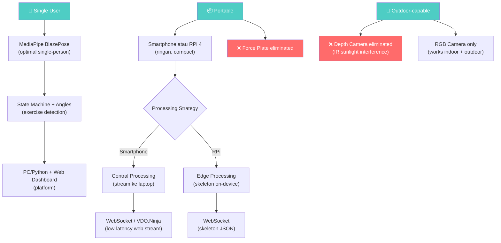

# 📄 Fitness Tracking Eye — Refined Analysis (v3.0)

> **Update**: Constraint baru diterapkan — Single User, Portable, Indoor-optimized + Outdoor-capable
> Tanggal: 1 September 2026
> Deadline Keputusan: **Rabu, 3 September 2026**

---

## Constraint yang Ditetapkan

| Constraint | Detail | Impact Level |
|:---|:---|:---|
| 🧑 **Single User** | Hanya 1 orang yang ditrack, tidak perlu multi-person | 🔴 High — mengubah scoring Pilar 1,7,8 |
| 📦 **Portable** | Harus bisa dibawa & quick setup di lokasi berbeda | 🔴 High — eliminasi beberapa opsi Pilar 2,4 |
| 🏠 **Indoor-optimized** | Performa terbaik di indoor | 🟡 Medium — mempengaruhi Pilar 4,5 |
| 🌳 **Outdoor-capable** | Tetap harus berfungsi di outdoor | 🔴 High — eliminasi depth camera |
| 💰 **Budget flexible** | Tidak jadi faktor eliminasi sekarang | ⚪ Low |

---

## 1. Impact Analysis: Bagaimana Constraint Mengubah Setiap Pilar

### Pilar 1 — Pose Estimation Engine

**Impact: Single User** mengeliminasi keunggulan multi-person detection.

| Engine | Score Sebelum | Score Setelah Constraint | Perubahan |
|:---|:---|:---|:---|
| **MediaPipe BlazePose** | ⭐⭐⭐⭐ | ⭐⭐⭐⭐⭐ | ↑ Dirancang khusus single-person, no overhead |
| **RTMPose** | ⭐⭐⭐⭐⭐ | ⭐⭐⭐⭐ | ↓ Butuh separate detector — unnecessary overhead |
| **MoveNet** | ⭐⭐⭐ | ⭐⭐⭐ | → Tetap, 17 keypoints masih kurang |
| **YOLO Pose** | ⭐⭐⭐⭐ | ⭐⭐⭐ | ↓ Unified detect+pose overkill untuk 1 person |
| **OpenPose** | ⭐⭐⭐ | ⭐⭐ | ↓ Multi-person fokus, heavy, AGPL license |

---

### Pilar 2 — Hardware Kamera

**Impact: Portable** mengeliminasi setup yang berat/rumit.

| Hardware | Score Sebelum | Score Setelah Portable | Alasan |
|:---|:---|:---|:---|
| **ESP32-CAM** | ⭐⭐ | ⭐⭐⭐ | ↑ Super ringan & kecil, tapi FPS tetap masalah |
| **RPi 4 + Camera** | ⭐⭐⭐⭐ | ⭐⭐⭐⭐ | → Cukup portable dengan case kecil |
| **RPi 5 + Camera** | ⭐⭐⭐⭐ | ⭐⭐⭐⭐ | → Sama portable dengan Pi 4 |
| **Smartphone** | ⭐⭐⭐ | ⭐⭐⭐⭐⭐ | ↑↑ **Most portable** — sudah ada di saku |
| **IP Camera** | ⭐⭐⭐ | ⭐⭐ | ↓ POE wiring tidak portable, bulky mounting |

> [!IMPORTANT]
> **Portability mengubah game:** Smartphone menjadi opsi yang jauh lebih menarik untuk portable deployment. Bayangkan: 4 HP lama dipasang di 4 mini tripod — muat dalam 1 backpack.

---

### Pilar 4 — Sensor Pendukung

**Impact: Portable + Outdoor** mengubah viability drastis.

| Sensor | Portable? | Outdoor? | New Score |
|:---|:---|:---|:---|
| **Tanpa sensor tambahan** | ✅ | ✅ | ⭐⭐⭐ (simple is good) |
| **IMU (MPU6050+ESP32)** | ✅✅ Super kecil | ✅ | ⭐⭐⭐⭐ |
| **Force Plate/Jump Mat** | ❌ Berat, tidak portable | ✅ | ⭐⭐ ↓↓ |
| **Depth Camera (ToF/LiDAR)** | ✅ Cukup kecil | ❌❌ **GAGAL outdoor** | ⭐⭐ ↓↓ |
| **mmWave Radar** | ✅ Kecil | ✅ | ⭐⭐⭐ |
| **EMG** | ⚠️ Perlu kontak kulit | ✅ | ⭐⭐ |

> [!WARNING]
> **Depth Camera TERELIMINASI** untuk outdoor use:
> - ToF sensor (Intel RealSense, Azure Kinect) menggunakan infrared yang **sama wavelength-nya dengan sinar matahari**
> - Di outdoor terik, sensor kebanjiran ambient IR → Signal-to-Noise Ratio turun drastis
> - Hasil: depth map penuh noise, "flying pixels", atau gagal total
> - **OAK-D** bisa fallback ke stereo RGB, tapi depth estimation-nya degraded
>
> **Force Plate TERELIMINASI** untuk portable:
> - Berat (plywood + strain gauge = beberapa kg)
> - Tidak praktis dibawa ke outdoor/gym berbeda
> - Butuh permukaan rata dan stabil
> 
> **DIY Jump Mat masih viable** (ringan, bisa digulung) tapi nilainya terbatas jika hanya untuk 2 dari 5 exercise.

---

### Pilar 5 — Communication Protocol

**Impact: Outdoor** = mungkin tidak ada WiFi router tersedia.

| Skenario | Solusi |
|:---|:---|
| **Indoor** | Dedicated WiFi router (5GHz) — optimal |
| **Outdoor** | Portable WiFi hotspot / travel router (GL.iNet Slate AX) |
| **Outdoor no internet** | Local WiFi mesh — HP sebagai hotspot + camera nodes connect |

**Key Insight:** Jika menggunakan smartphone sebagai kamera, salah satu HP bisa menjadi WiFi hotspot — **tidak perlu perangkat tambahan** untuk outdoor.

---

### Pilar 7 — 3D Reconstruction

**Impact: Single user** menyederhanakan.

- Tidak perlu identity tracking antar kamera
- Triangulation lebih clean (1 skeleton, no ambiguity)
- Best-View Selection paling cocok untuk portable setup karena kalibrasi minimal

---

## 2. Refined Scoring — Semua Pilar dengan Constraint Baru

### Pilar 1: Pose Estimation Engine — Final Score

| Engine | Accuracy | Speed | 3D | Single User | Portability | Outdoor | Edge Capable | License | **TOTAL** |
|:---|:---|:---|:---|:---|:---|:---|:---|:---|:---|
| **MediaPipe** | 4 | 4 | 5 (native 3D) | 5 | 5 | 4 | 4 (RPi ok) | 5 (Apache) | **36/40** ⭐ |
| RTMPose | 5 | 5 | 2 | 3 | 4 | 4 | 3 | 5 (Apache) | 31/40 |
| MoveNet | 3 | 5 | 1 | 4 | 5 | 4 | 5 (very light) | 5 (Apache) | 32/40 |
| YOLO Pose | 4 | 4 | 1 | 3 | 3 | 4 | 2 | 2 (AGPL) | 23/40 |
| OpenPose | 5 | 1 | 1 | 2 | 1 | 3 | 1 | 1 (AGPL) | 15/40 |

> **Winner: MediaPipe BlazePose** — unggul terutama di native 3D support, single-user optimization, dan edge capability.

---

### Pilar 2: Hardware Kamera — Final Score

| Hardware | Image Quality | FPS | Portable | Edge ML | Outdoor | Setup Speed | Power | **TOTAL** |
|:---|:---|:---|:---|:---|:---|:---|:---|:---|
| **Smartphone** | 5 | 5 | 5 | 4 | 5 | 5 | 3 (battery) | **32/35** ⭐ |
| RPi 5 + Cam v3 | 4 | 4 | 3 | 4 | 4 | 3 | 2 | 24/35 |
| RPi 4 + Cam v2 | 3 | 3 | 3 | 3 | 4 | 3 | 2 | 21/35 |
| ESP32-CAM | 2 | 1 | 5 | 1 | 4 | 4 | 5 | 22/35 |
| IP Camera | 4 | 3 | 1 | 1 | 3 | 2 | 2 | 16/35 |

> **Winner: Smartphone** — portability constraint membuat smartphone menjadi pilihan terkuat. Sudah punya kamera bagus, WiFi, IMU built-in, dan bisa on-device processing.

---

### Pilar 3: Processing Strategy — Final Score

| Strategy | Single-User | Portable | Outdoor | Dev Speed | Scalable | **TOTAL** |
|:---|:---|:---|:---|:---|:---|:---|
| **Central** | 5 | 4 | 3 | 5 | 3 | **20/25** ⭐ (for smartphone) |
| Edge | 5 | 3 | 4 | 3 | 5 | 20/25 |

> **Tie!** Tapi jika pakai smartphone → Central Processing lebih natural (stream ke laptop). Jika pakai RPi → Edge Processing lebih efisien.

---

### Pilar 4: Sensor Pendukung — Final Score

| Sensor | Portable | Outdoor | Complementarity | Complexity | **TOTAL** |
|:---|:---|:---|:---|:---|:---|
| **IMU (ESP32+MPU6050)** | 5 | 5 | 4 | 3 | **17/20** ⭐ |
| None (camera only) | 5 | 5 | 1 | 5 | 16/20 |
| mmWave Radar | 4 | 4 | 3 | 2 | 13/20 |
| Jump Mat (portable) | 3 | 3 | 3 | 3 | 12/20 |
| Depth Camera | 4 | 1 | 5 | 2 | 12/20 |
| Force Plate | 1 | 2 | 4 | 2 | 9/20 |
| EMG | 3 | 4 | 3 | 1 | 11/20 |

> **Winner: IMU** atau **None** — IMU menambah value untuk counting accuracy & anti-occlusion, tapi camera-only sudah viable.

---

## 3. Tiga Konfigurasi yang Direkomendasikan

### 🅰️ Konfigurasi "Starter" — Fastest to Build

```
┌─────────────────────────────────────────┐
│           STARTER KIT                    │
│                                          │
│  📷 Kamera: 2-4× Smartphone (reuse)     │
│  🧠 Engine: MediaPipe BlazePose         │
│  ⚙️ Processing: Central (1 laptop)       │
│  📡 Network: HP hotspot (no router)      │
│  🔺 3D: Best-View Selection             │
│  🏋️ Detection: State Machine + Angles    │
│  🖥️ Platform: PC/Python                  │
│  📏 Kalibrasi: Minimal (no extrinsic)    │
│  🔌 Sensor tambahan: None                │
│                                          │
│  Total Cost: ~$0-50 (mounts only)        │
│  Setup Time: 5 menit                     │
│  Portability: ⭐⭐⭐⭐⭐ (fits in pocket)  │
│  Accuracy: ⭐⭐⭐ (2D, view-dependent)    │
└─────────────────────────────────────────┘
```

**Pro:** Mulai hari ini, gratis, super portable
**Con:** Akurasi terbatas pada 2D, baterai HP cepat habis, latency streaming

---

### 🅱️ Konfigurasi "Balanced" — Best Value

```
┌─────────────────────────────────────────┐
│           BALANCED KIT                   │
│                                          │
│  📷 Kamera: 4× RPi 4 + Camera Module    │
│  🧠 Engine: MediaPipe BlazePose Lite     │
│  ⚙️ Processing: Edge (skeleton on RPi)   │
│  📡 Network: Travel router (5GHz)        │
│  🔺 3D: Triangulation (calibrated)       │
│  🏋️ Detection: State Machine + Angles    │
│  🖥️ Platform: PC/Python + Web Dashboard  │
│  📏 Kalibrasi: ChArUco                   │
│  🔌 Sensor tambahan: None atau IMU        │
│                                          │
│  Total Cost: ~$350-500                   │
│  Setup Time: 15-20 menit                 │
│  Portability: ⭐⭐⭐ (backpack)            │
│  Accuracy: ⭐⭐⭐⭐ (true 3D)              │
└─────────────────────────────────────────┘
```

**Pro:** True 3D reconstruction, edge processing efficient, professional quality
**Con:** Setup time lebih lama, butuh kalibrasi, power supply per RPi

---

### 🅲 Konfigurasi "Pro" — Maximum Capability

```
┌─────────────────────────────────────────┐
│           PRO KIT                        │
│                                          │
│  📷 Kamera: 4× RPi 5 + Camera v3 +      │
│             AI HAT (Hailo)               │
│  🧠 Engine: MediaPipe Full (30 FPS)      │
│  ⚙️ Processing: Edge (30 FPS per node)   │
│  📡 Network: Dedicated travel router      │
│  🔺 3D: Triangulation + Kalman Filter    │
│  🏋️ Detection: State Machine → ML (LSTM) │
│  🖥️ Platform: PC + Web + Mobile App      │
│  📏 Kalibrasi: ChArUco + Self-cal         │
│  🔌 Sensor: IMU wristband (ESP32+BNO055) │
│  ⚡ Fusion: Adaptive Camera+IMU fusion    │
│                                          │
│  Total Cost: ~$800-1000                  │
│  Setup Time: 20-30 menit                 │
│  Portability: ⭐⭐⭐ (pelican case)        │
│  Accuracy: ⭐⭐⭐⭐⭐ (3D + sensor fusion)  │
└─────────────────────────────────────────┘
```

**Pro:** Maximum accuracy, 30 FPS edge processing, sensor fusion, future-proof
**Con:** Paling mahal, setup complex, maintenance per node

---

## 4. Portable Kit Design

### Apa yang muat di 1 backpack?

```
┌──────────────────────────────────────┐
│          🎒 PORTABLE KIT              │
│                                       │
│  Layer 1 (Bottom):                    │
│  ├── 4× Mini tripod (foldable)        │
│  └── Travel router + powerbank        │
│                                       │
│  Layer 2 (Middle):                    │
│  ├── 4× Camera node (RPi+cam in case) │
│  │   or 4× Smartphone                │
│  └── 4× USB-C cable + power adapter   │
│                                       │
│  Layer 3 (Top):                       │
│  ├── Laptop (main device)             │
│  ├── ChArUco calibration board        │
│  └── Optional: IMU wristband          │
│                                       │
│  Total Weight: ~3-5 kg                │
│  Setup Procedure:                     │
│  1. Place 4 tripods (2 min)           │
│  2. Mount cameras & power (2 min)     │
│  3. Connect WiFi (1 min)              │
│  4. Quick calibration (5 min)         │
│  5. Start tracking (instant)          │
│  Total: ~10 menit                     │
└──────────────────────────────────────┘
```

---

## 5. Indoor vs Outdoor — Dampak per Teknologi

| Teknologi | Indoor | Outdoor | Catatan |
|:---|:---|:---|:---|
| **RGB Camera (MediaPipe)** | ⭐⭐⭐⭐⭐ | ⭐⭐⭐⭐ | Outdoor: perlu avoid backlight (matahari di belakang user) |
| **Depth Camera (ToF)** | ⭐⭐⭐⭐⭐ | ⭐ ❌ | **IR interference dari matahari** — flying pixels, noise |
| **IMU** | ⭐⭐⭐⭐⭐ | ⭐⭐⭐⭐⭐ | Tidak terpengaruh lingkungan |
| **mmWave Radar** | ⭐⭐⭐⭐⭐ | ⭐⭐⭐⭐ | Sedikit interference dari objek bergerak di outdoor |
| **WiFi stability** | ⭐⭐⭐⭐⭐ | ⭐⭐⭐ | Outdoor: perlu portable router/hotspot, jangkauan terbatas |
| **Power supply** | ⭐⭐⭐⭐⭐ (outlet) | ⭐⭐⭐ (powerbank) | Outdoor: butuh powerbank capacity cukup |
| **Camera mounting** | ⭐⭐⭐⭐ (wall/shelf) | ⭐⭐⭐ (tripod) | Outdoor: tripod di tanah tidak rata, angin |

### Outdoor Optimization Tips:
1. **Posisi user agar matahari TIDAK di belakang user** (avoid backlight)
2. User sebaiknya **berpakaian kontras** dengan background
3. Gunakan **shaded area** jika memungkinkan (pohon, gazebo)
4. Set camera **exposure** ke manual mode untuk menghindari auto-adjust flickering
5. Powerbank minimum **10000mAh** per RPi (cukup ~3-4 jam) atau **20000mAh** per smartphone

---

## 6. Dependency Chain — Resolved

Berdasarkan constraint yang ada, berikut dependency chain yang sudah ter-resolve:



---

## 7. Summary: APA, MENGAPA, BAGAIMANA

### 🔵 APA yang akan dibuat?

**Fitness Tracking Eye** — Sistem portable multi-kamera wireless yang mendeteksi, menghitung repetisi, dan menganalisis form dari 5 exercise (Push Up, Pull Up, Sit Up, Squat Jump, Vertical Jump) untuk satu pengguna.

### 🟢 MENGAPA setiap pilihan dibuat?

| Pilihan | Mengapa |
|:---|:---|
| **MediaPipe BlazePose** | Satu-satunya engine yang memberikan 33 keypoints 3D, ringan (edge-capable), native single-person, Apache license |
| **RGB Camera (bukan Depth)** | Depth camera gagal di outdoor (sinar matahari = IR interference). RGB camera bekerja di indoor DAN outdoor |
| **Portable kit** | Pengguna perlu bisa bawa ke gym, taman, rumah. Setup harus <10 menit |
| **State Machine + Angles** | Paling cepat dibangun, akurasi 90-95% sudah cukup untuk v1, bisa di-upgrade ke ML nanti |
| **WebSocket** | Low-latency, browser-native, cocok untuk skeleton data relay |

### 🔴 BAGAIMANA membangunnya?

**Phase 1 — Core Engine (Week 1):**
- Single webcam + MediaPipe → angle calculation → Push Up counter
- Validasi akurasi counting pada 1 exercise

**Phase 2 — All 5 Exercises (Week 2):**
- Implement semua exercise detector
- Form analysis per exercise

**Phase 3 — Multi-Camera (Week 3-4):**
- Multi-camera streaming (smartphone atau RPi)
- Best-View Selection → upgrade ke Triangulation
- Portable kit assembly & testing

**Phase 4 — Dashboard & Polish (Week 5-6):**
- Web dashboard real-time
- Outdoor testing & optimization
- Optional: IMU integration

---

## 8. Open Questions — Perlu Dijawab Sebelum Rabu

> [!IMPORTANT]
> Berikut pertanyaan terakhir yang perlu kita finalisasi:

### Q1: Hardware Kamera — Smartphone atau Raspberry Pi?

| | Smartphone | RPi 4 |
|:---|:---|:---|
| Cost | $0 (reuse) | ~$350 (4 unit) |
| Portability | ⭐⭐⭐⭐⭐ | ⭐⭐⭐ |
| Image Quality | ⭐⭐⭐⭐⭐ | ⭐⭐⭐ |
| Stability | ⭐⭐⭐ (app crash risk) | ⭐⭐⭐⭐⭐ (Linux stable) |
| Edge Processing | ⭐⭐⭐⭐ | ⭐⭐⭐ (8-15 FPS) |
| Setup Speed | ⭐⭐⭐⭐⭐ (instant) | ⭐⭐⭐ (boot time) |
| Battery | ⭐⭐ (1-3 hr) | ⭐⭐ (powerbank 4-6 hr) |

→ **Apakah Anda punya 2-4 HP lama yang bisa dipakai?**

### Q2: Processing — Central atau Edge?
→ Tergantung jawaban Q1. Smartphone → Central. RPi → Edge.

### Q3: Sensor Tambahan — Perlu IMU?
→ IMU menambah akurasi counting dan anti-occlusion. Tapi menambah complexity & harus dipakai di tubuh. **Worth it?**

### Q4: 3D Reconstruction — Perlu true 3D?
→ Best-View Selection (2D multi-angle) sudah cukup untuk counting & basic form. Triangulation (true 3D) butuh kalibrasi tapi memberikan depth analysis. **Mana prioritas?**

### Q5: Prioritas Exercise — Mulai dari mana?
→ Kelima exercise punya complexity berbeda. Rekomendasi urutan: Push Up → Sit Up → Pull Up → Squat Jump → Vertical Jump

### Q6: Target Deliverable Rabu?
→ Apakah Rabu kita ingin sudah punya **prototype berjalan** (minimal 1 exercise + 1 camera), atau cukup **dokumen final decision** saja?
