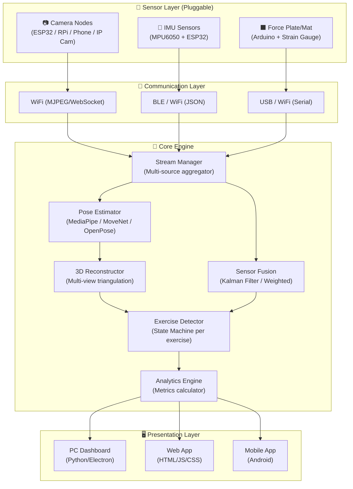

# 🏋️ Fitness Tracking Eye — Implementation Plan

> **Goal**: Membangun sistem fitness tracking modular yang mendukung **semua opsi sensor**, **semua opsi hardware kamera**, **semua platform**, dan **kedua processing strategy**, dengan fitur lengkap (rep counting + form analysis + jump metrics) menggunakan 4 kamera 360°.

---

## User Review Required

> [!IMPORTANT]
> Sistem ini dirancang dengan **arsitektur modular** agar semua opsi bisa co-exist. User bisa switch antara:
> - Camera-only mode vs Hybrid (Camera+IMU) vs Hybrid (Camera+Force Plate)
> - ESP32-CAM vs Raspberry Pi vs Smartphone vs IP Camera
> - Edge Processing vs Central Processing
> - PC App vs Web App vs Mobile App
>
> **Trade-off**: Mendukung semua opsi berarti codebase lebih besar, tapi arsitektur plugin/adapter pattern membuatnya manageable.

> [!WARNING]
> **Phase 1 akan dimulai dengan single-camera prototype** pada PC/Python untuk memvalidasi core engine sebelum scaling ke multi-camera dan multi-platform. Ini adalah best practice untuk menghindari debugging nightmare di awal.

---

## Proposed Changes

### System Architecture Overview



---

### Component 1: Project Foundation & Core Structure

#### [NEW] [project root structure](file:///d:/Aaa/Fitness-Tracking-Eye)

```
Fitness-Tracking-Eye/
├── README.md                          # Project overview & setup guide
├── requirements.txt                   # Python dependencies
├── config/
│   ├── camera_config.yaml             # Camera setup (type, IP, resolution, etc.)
│   ├── exercise_config.yaml           # Exercise parameters (angles, thresholds)
│   └── sensor_config.yaml             # Sensor configurations (IMU, force plate)
│
├── src/
│   ├── __init__.py
│   │
│   ├── core/                          # 🧠 Core Engine
│   │   ├── __init__.py
│   │   ├── stream_manager.py          # Multi-source stream aggregator
│   │   ├── pose_estimator.py          # Pose estimation (MediaPipe/MoveNet/OpenPose adapter)
│   │   ├── reconstructor_3d.py        # Multi-view 3D triangulation
│   │   ├── exercise_detector.py       # Exercise detection state machine
│   │   ├── sensor_fusion.py           # Sensor data fusion (camera + IMU + force plate)
│   │   ├── analytics.py               # Metrics calculation engine
│   │   └── calibration.py             # Camera calibration utilities
│   │
│   ├── sensors/                       # 🔌 Sensor Adapters (Pluggable)
│   │   ├── __init__.py
│   │   ├── base_sensor.py             # Abstract base class for all sensors
│   │   ├── camera/
│   │   │   ├── __init__.py
│   │   │   ├── base_camera.py         # Abstract camera interface
│   │   │   ├── esp32_cam.py           # ESP32-CAM adapter (MJPEG stream)
│   │   │   ├── raspi_cam.py           # Raspberry Pi camera adapter
│   │   │   ├── smartphone_cam.py      # Smartphone camera adapter (IP Webcam app)
│   │   │   ├── ip_cam.py              # Generic IP camera adapter (RTSP/ONVIF)
│   │   │   └── webcam.py              # Local webcam (for prototyping)
│   │   ├── imu/
│   │   │   ├── __init__.py
│   │   │   ├── base_imu.py            # Abstract IMU interface
│   │   │   ├── mpu6050_esp32.py       # MPU6050 via ESP32 BLE/WiFi
│   │   │   └── imu_processor.py       # IMU signal processing & rep detection
│   │   └── force_plate/
│   │       ├── __init__.py
│   │       ├── base_force.py          # Abstract force sensor interface
│   │       ├── arduino_force.py       # Arduino strain gauge / FSR force plate
│   │       └── jump_calculator.py     # Jump height calculation from flight time
│   │
│   ├── exercises/                     # 🏋️ Exercise-Specific Logic
│   │   ├── __init__.py
│   │   ├── base_exercise.py           # Abstract exercise class
│   │   ├── push_up.py                 # Push Up detection & analysis
│   │   ├── pull_up.py                 # Pull Up detection & analysis
│   │   ├── sit_up.py                  # Sit Up detection & analysis
│   │   ├── squat_jump.py              # Squat Jump detection & analysis
│   │   └── vertical_jump.py           # Vertical Jump detection & analysis
│   │
│   ├── processing/                    # ⚙️ Processing Strategies
│   │   ├── __init__.py
│   │   ├── edge_processor.py          # Edge processing (skeleton extraction on camera node)
│   │   └── central_processor.py       # Central processing (raw video processing)
│   │
│   └── utils/
│       ├── __init__.py
│       ├── angle_calculator.py        # Joint angle computation
│       ├── smoothing.py               # Landmark smoothing (moving average, EMA)
│       ├── timestamp_sync.py          # Multi-stream timestamp synchronization
│       └── visualization.py           # Skeleton/angle overlay drawing
│
├── edge/                              # 📷 Edge Device Code (for Raspberry Pi / ESP32)
│   ├── raspi/
│   │   ├── edge_streamer.py           # RPi edge processing + streaming skeleton
│   │   └── requirements_raspi.txt
│   ├── esp32/
│   │   ├── esp32_cam_streamer/        # Arduino/PlatformIO project for ESP32-CAM
│   │   │   └── esp32_cam_streamer.ino
│   │   └── esp32_imu_sender/          # Arduino project for ESP32 + MPU6050
│   │       └── esp32_imu_sender.ino
│   └── arduino/
│       └── force_plate_reader/        # Arduino project for force plate
│           └── force_plate_reader.ino
│
├── web/                               # 🌐 Web Dashboard
│   ├── index.html
│   ├── css/
│   │   └── styles.css
│   ├── js/
│   │   ├── app.js                     # Main application logic
│   │   ├── websocket_client.js        # WebSocket connection to Python backend
│   │   ├── exercise_renderer.js       # Exercise visualization
│   │   └── charts.js                  # Analytics charts
│   └── assets/
│
├── tests/
│   ├── test_angle_calculator.py
│   ├── test_exercise_detector.py
│   ├── test_pose_estimator.py
│   └── test_sensor_fusion.py
│
├── docs/
│   ├── hardware_setup.md              # Hardware assembly guide
│   ├── camera_comparison.md           # Detailed camera hardware analysis
│   ├── sensor_comparison.md           # Detailed sensor analysis
│   └── api_reference.md
│
└── scripts/
    ├── calibrate_cameras.py           # Camera calibration script
    ├── test_single_camera.py          # Quick single camera test
    └── benchmark_performance.py       # FPS & latency benchmarking
```

---

### Component 2: Hardware Comparison Analysis

Setiap opsi hardware akan didokumentasikan dengan detail pros/cons:

#### [NEW] [camera_comparison.md](file:///d:/Aaa/Fitness-Tracking-Eye/docs/camera_comparison.md)

**ESP32-CAM ($5-10/unit)**
| ✅ Keuntungan | ❌ Kekurangan |
|:---|:---|
| Ultra murah — 4 unit hanya ~$40 | Resolusi max 640x480 (UXGA mode sering crash) |
| WiFi built-in, compact | FPS rendah: 10-15 FPS pada 640x480 |
| Mudah di-flash via Arduino IDE | **Tidak bisa edge processing** — hanya bisa stream |
| Konsumsi daya rendah (~250mA) | Stream MJPEG saja (no WebSocket native) |
| Banyak tutorial & community | Kualitas gambar buruk di low-light |
| Bisa pakai external antenna | WiFi tidak stabil saat multi-stream |
| | Tidak ada hardware timestamp sync |

**Raspberry Pi 4 + Camera Module v2 ($50-80/unit)**
| ✅ Keuntungan | ❌ Kekurangan |
|:---|:---|
| **Bisa edge processing** (MediaPipe ~15-20 FPS) | Lebih mahal — 4 unit ~$300 |
| 1080p @ 30FPS camera | Butuh power supply + SD card per unit |
| Full Linux OS — flexible programming | Setup lebih kompleks |
| WiFi 5GHz + BLE built-in | Form factor lebih besar |
| Python + OpenCV + MediaPipe native | Konsumsi daya ~3-5W |
| Hardware timestamp via GPIO possible | Bisa overheat tanpa heatsink |
| Bisa jadi standalone node | Stok kadang sulit (supply chain) |

**Smartphone sebagai Kamera ($0 reuse)**
| ✅ Keuntungan | ❌ Kekurangan |
|:---|:---|
| Gratis — reuse HP lama | Baterai cepat habis saat streaming |
| Kualitas kamera sangat bagus (1080p+) | Perlu app pihak ketiga (IP Webcam, DroidCam) |
| **Bisa edge processing** via MediaPipe Android | Mounting/positioning tidak praktis |
| Already has WiFi, BLE, IMU sensors | Tidak semua HP punya performa sama |
| Prototyping tercepat | Overhead panas saat streaming lama |
| Built-in IMU bisa jadi bonus data | App mungkin tertutup oleh OS (battery saver) |

**IP Camera - Reolink/Wyze ($25-40/unit)**
| ✅ Keuntungan | ❌ Kekurangan |
|:---|:---|
| Plug-and-play, very stable stream | **Tidak bisa edge processing** |
| 1080p @ 15-30 FPS | Latency lebih tinggi (RTSP overhead) |
| Sudah ada mounting hardware | Tidak bisa custom firmware (locked) |
| RTSP/ONVIF protocol standar | Kualitas bervariasi per merk |
| PoE option (Reolink) — no WiFi needed | Beberapa butuh cloud subscription |
| Night vision built-in | Indoor-only focus (wide angle mungkin distort) |

---

### Component 3: Processing Strategy Comparison

#### [NEW] [edge_processor.py](file:///d:/Aaa/Fitness-Tracking-Eye/src/processing/edge_processor.py)
#### [NEW] [central_processor.py](file:///d:/Aaa/Fitness-Tracking-Eye/src/processing/central_processor.py)

**Edge Processing (MediaPipe di setiap camera node)**
| ✅ Keuntungan | ❌ Kekurangan |
|:---|:---|
| Bandwidth super rendah (~1KB/frame skeleton vs ~100KB raw) | Butuh edge device powerful (RPi 4 minimum) |
| Scalable — tambah kamera tanpa bottleneck bandwidth | Setup lebih kompleks per node |
| Main device load ringan — hanya fusion & logic | Debugging lebih sulit (distributed system) |
| Toleran terhadap WiFi instability | Versi MediaPipe harus konsisten di semua node |
| Bisa jalan dengan router biasa | Edge device perlu maintenance (update, reboot) |
| Privacy — raw video tidak pernah dikirim | Latency dari edge processing (~30-50ms per node) |

**Central Processing (Raw video stream ke main device)**
| ✅ Keuntungan | ❌ Kekurangan |
|:---|:---|
| Simple setup — kamera hanya stream | **Bandwidth tinggi** — 4 kamera 720p ≈ 40Mbps |
| Satu versi software di satu tempat | Main device harus powerful (GPU recommended) |
| Mudah debug — semua di satu mesin | Butuh dedicated WiFi router 5GHz |
| Bisa ganti pose estimator tanpa update edge | Latency dari network streaming |
| Record raw video untuk analysis nanti | Tidak scalable — setiap kamera tambah load |
| Konsistensi processing terjamin | WiFi congestion saat 4+ stream simultaneous |

---

### Component 4: Platform Comparison

**PC/Laptop dengan Python**
| ✅ Keuntungan | ❌ Kekurangan |
|:---|:---|
| **Performa terbaik** — GPU support untuk heavy ML | Tidak portable |
| Development & debugging paling mudah | Harus di depan PC |
| Semua library tersedia (MediaPipe, OpenCV, TF) | Overhead OS (Windows update, etc.) |
| Bisa multi-monitor untuk dashboard | Konsumsi daya tinggi |
| Python ecosystem sangat mature | Distribusi ke user lain lebih ribet |

**Web Application (Browser-based)**
| ✅ Keuntungan | ❌ Kekurangan |
|:---|:---|
| **Cross-platform** — PC, tablet, phone, semua bisa | Perlu backend server tetap jalan |
| No installation needed | Browser performance terbatas vs native |
| Real-time update via WebSocket | WebSocket bisa drop di network buruk |
| Modern UI framework (bisa sangat cantik) | MediaPipe Web API ada, tapi terbatas |
| Shareable — orang lain bisa akses via URL | File access terbatas (no direct USB/BLE) |

**Mobile App (Android)**
| ✅ Keuntungan | ❌ Kekurangan |
|:---|:---|
| Portable — bawa ke mana saja | Development lebih lama (Java/Kotlin/Flutter) |
| Bisa pakai kamera HP sendiri sebagai salah satu node | Performance terbatas vs PC |
| Direct BLE access untuk IMU sensor | Heat management (HP panas saat processing lama) |
| Touch UI natural | Screen kecil untuk dashboard complex |
| Offline capable | Perlu publish ke Play Store |

---

### Component 5: Sensor Approach Comparison

#### [NEW] [sensor_comparison.md](file:///d:/Aaa/Fitness-Tracking-Eye/docs/sensor_comparison.md)

**Approach 1: Multi-Camera RGB Only**
| ✅ Keuntungan | ❌ Kekurangan |
|:---|:---|
| Visual form analysis terbaik — bisa lihat postur detail | Sensitif terhadap pencahayaan |
| Tidak perlu pakai sensor apapun di tubuh | Occlusion (tubuh terhalang) problematic |
| 3D reconstruction dari multi-view | Butuh kalibrasi kamera |
| Video bisa direkam untuk review | Privacy concern (video recording) |
| Most natural — user cuma latihan biasa | Kamera harus fixed position |

**Approach 2: Hybrid Camera + IMU Sensor**
| ✅ Keuntungan | ❌ Kekurangan |
|:---|:---|
| **Anti-occlusion** — IMU tetap track walau kamera terhalang | User harus pakai sensor di tubuh |
| Fusion meningkatkan akurasi 15-25% | Kompleksitas kalibrasi lebih tinggi |
| IMU high-frequency (100-1000Hz) melengkapi camera (30Hz) | Sensor bisa geser/lepas saat berkeringat |
| Dynamic trust — auto switch sumber data terpercaya | IMU drift over time (perlu periodic reset) |
| Fast motion tracking lebih baik | Biaya tambahan per sensor unit |

**Approach 3: Hybrid Camera + Force Plate/Jump Mat**
| ✅ Keuntungan | ❌ Kekurangan |
|:---|:---|
| **Jump height paling akurat** — via flight time physics | Hanya untuk exercise yang involve lantai |
| Ground reaction force (GRF) data — power analysis | Area terbatas (user harus di atas mat) |
| Landing mechanics analysis | Tidak berguna untuk pull up |
| Simple DIY build (Arduino + strain gauge) | Force plate perlu kalibrasi rutin |
| Bisa ukur asymmetry (kiri vs kanan) | Tidak portable |

---

### Component 6: Core Engine Implementation

#### [NEW] [base_exercise.py](file:///d:/Aaa/Fitness-Tracking-Eye/src/exercises/base_exercise.py)

Abstract class untuk semua exercise dengan interface standar:
- `detect_phase(landmarks)` → current phase (UP/DOWN/JUMP/etc.)
- `count_rep()` → increment + validate full cycle
- `analyze_form(landmarks)` → form score + correction tips
- `get_metrics()` → all calculated metrics

#### [NEW] [push_up.py](file:///d:/Aaa/Fitness-Tracking-Eye/src/exercises/push_up.py)
- Elbow angle tracking (180° → 90° → 180°)
- Hip alignment check (shoulder-hip-ankle line)
- Depth validation (minimum elbow angle threshold)

#### [NEW] [pull_up.py](file:///d:/Aaa/Fitness-Tracking-Eye/src/exercises/pull_up.py)
- Chin-above-bar detection via nose/chin Y-position
- Elbow angle tracking
- Kipping detection (excessive hip swing angle)

#### [NEW] [sit_up.py](file:///d:/Aaa/Fitness-Tracking-Eye/src/exercises/sit_up.py)
- Hip angle tracking (torso vs thigh)
- Full ROM validation
- Neck strain detection (head forward check)

#### [NEW] [squat_jump.py](file:///d:/Aaa/Fitness-Tracking-Eye/src/exercises/squat_jump.py)
- Knee angle tracking + squat depth check
- Airborne detection (ankle Y-position displacement)
- Landing knee angle validation (injury prevention)
- Power calculation from jump data

#### [NEW] [vertical_jump.py](file:///d:/Aaa/Fitness-Tracking-Eye/src/exercises/vertical_jump.py)
- Maximum height calculation (hip displacement or flight time)
- Counter-movement depth analysis
- Hang time measurement
- Integration with force plate data (if available)

#### [NEW] [pose_estimator.py](file:///d:/Aaa/Fitness-Tracking-Eye/src/core/pose_estimator.py)
- Adapter pattern supporting MediaPipe, MoveNet, OpenPose
- Configurable via YAML
- Returns standardized landmark format regardless of backend

#### [NEW] [angle_calculator.py](file:///d:/Aaa/Fitness-Tracking-Eye/src/utils/angle_calculator.py)
- `calculate_angle(point_a, point_b, point_c)` → degrees
- `calculate_distance(point_a, point_b)` → pixels/meters
- `calculate_vertical_displacement(point, reference)` → delta Y

---

### Component 7: Web Dashboard

#### [NEW] [index.html](file:///d:/Aaa/Fitness-Tracking-Eye/web/index.html)
#### [NEW] [styles.css](file:///d:/Aaa/Fitness-Tracking-Eye/web/css/styles.css)
#### [NEW] [app.js](file:///d:/Aaa/Fitness-Tracking-Eye/web/js/app.js)

Dashboard features:
- Real-time multi-camera view (4 camera feeds + 3D skeleton)
- Exercise detection status & rep counter
- Form score gauge (0-100%)
- Live joint angle visualization
- Correction tips overlay
- Session analytics (charts, history)
- Sensor status panel (camera/IMU/force plate health)

---

### Component 8: Edge Device Code

#### [NEW] [esp32_cam_streamer.ino](file:///d:/Aaa/Fitness-Tracking-Eye/edge/esp32/esp32_cam_streamer/esp32_cam_streamer.ino)
- MJPEG streaming server
- WiFi auto-reconnect
- Configurable resolution & FPS

#### [NEW] [edge_streamer.py](file:///d:/Aaa/Fitness-Tracking-Eye/edge/raspi/edge_streamer.py)
- Local MediaPipe pose estimation
- Skeleton data streaming via WebSocket
- Timestamp synchronization

#### [NEW] [esp32_imu_sender.ino](file:///d:/Aaa/Fitness-Tracking-Eye/edge/esp32/esp32_imu_sender/esp32_imu_sender.ino)
- MPU6050 data reading at 100Hz
- BLE/WiFi data transmission
- Complementary filter for orientation

#### [NEW] [force_plate_reader.ino](file:///d:/Aaa/Fitness-Tracking-Eye/edge/arduino/force_plate_reader/force_plate_reader.ino)
- Strain gauge / FSR reading
- Ground contact detection
- Serial/WiFi data output

---

## Development Phases

### Phase 1: Foundation (Week 1-2)
- Setup project structure
- Implement single webcam + MediaPipe pose estimation
- Build angle calculator & smoothing utilities
- Create Push Up detection as proof-of-concept
- Basic terminal-based rep counter

### Phase 2: All Exercises (Week 3-4)
- Implement all 5 exercise detectors
- Build form analysis for each exercise
- Add jump metrics calculation
- Create exercise configuration system (YAML)

### Phase 3: Multi-Camera (Week 5-7)
- Implement camera adapters (all 4 types)
- Camera calibration utility
- Multi-view 3D reconstruction
- Stream manager & timestamp sync
- Edge processing pipeline

### Phase 4: Sensor Integration (Week 8-9)
- IMU sensor adapter (ESP32 + MPU6050)
- Force plate adapter (Arduino)
- Sensor fusion engine (Kalman filter)
- Hybrid mode implementation

### Phase 5: Dashboard & Polish (Week 10-12)
- Web dashboard with real-time visualization
- Analytics & session history
- Performance optimization
- Documentation & hardware setup guides
- Comprehensive testing

---

## Verification Plan

### Automated Tests
```bash
# Unit tests for core logic
python -m pytest tests/test_angle_calculator.py -v
python -m pytest tests/test_exercise_detector.py -v
python -m pytest tests/test_pose_estimator.py -v
python -m pytest tests/test_sensor_fusion.py -v

# Integration test with webcam
python scripts/test_single_camera.py

# Performance benchmark
python scripts/benchmark_performance.py
```

### Manual Verification
- Setiap exercise ditest dengan video sample dan real-time webcam
- Multi-camera setup ditest dengan 2 kamera dulu, lalu scale ke 4
- Rep counting accuracy divalidasi manual (target: <5% error)
- Form analysis divalidasi dengan known good/bad form videos
- Jump height dibandingkan dengan pengukuran manual
- Dashboard responsiveness ditest di berbagai screen size
- Edge vs Central processing latency comparison
