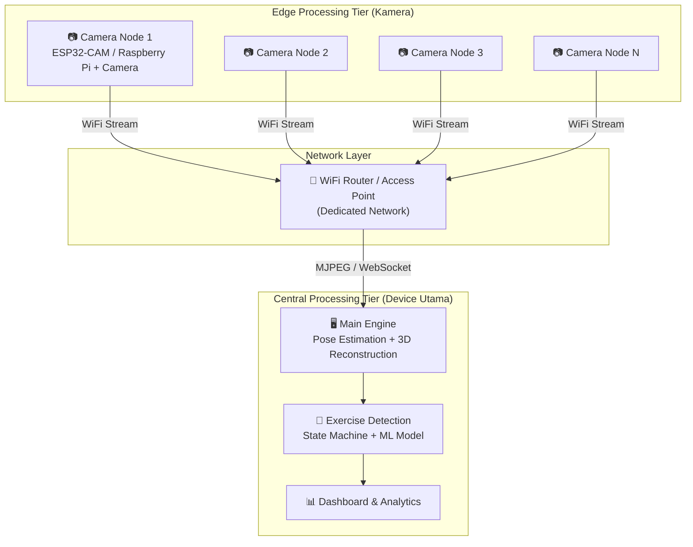
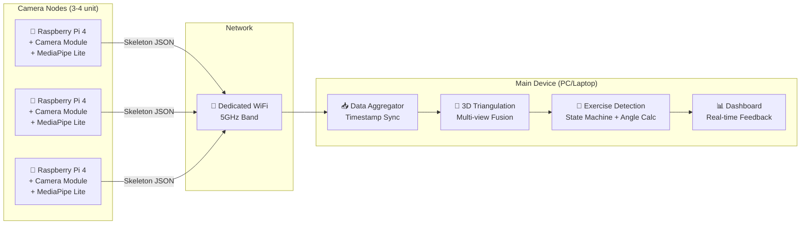
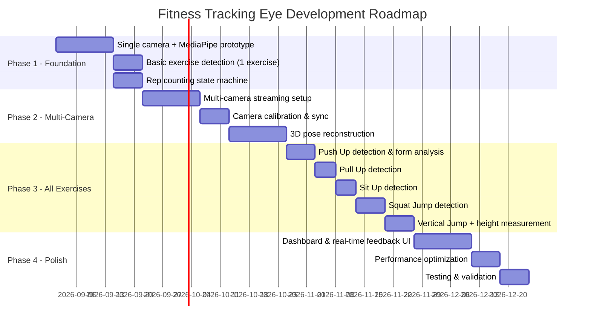

# 🏋️ Fitness Tracking Eye — Deep Research Document

> **Project Vision**: Sistem pelacakan fitness menggunakan motion capture dengan multiple wireless camera terintegrasi, diakses melalui satu device utama yang menjalankan seluruh proses kalkulasi dan deteksi gerakan.
>
> **Target Exercises**: Push Up, Pull Up, Sit Up, Squat Jump, Vertical Jump

---

## 1. Pendekatan Utama: Multi-Camera Wireless Motion Capture

### 1.1 Arsitektur Sistem

Arsitektur optimal untuk sistem multi-kamera wireless terdiri dari **3 tier**:



### 1.2 Dua Strategi Pemrosesan

| Strategi | Deskripsi | Pros | Cons |
|:---|:---|:---|:---|
| **A. Stream Raw Video** | Kamera mengirim video mentah → semua diproses di device utama | Sederhana, mudah debug | Butuh bandwidth tinggi, latency besar |
| **B. Edge Processing** | Kamera + edge device menjalankan 2D pose estimation lokal → hanya kirim skeleton data | Bandwidth sangat rendah, scalable | Butuh edge device lebih kuat (Raspberry Pi) |

> [!IMPORTANT]
> **Rekomendasi**: Strategi B (Edge Processing) jauh lebih scalable. Mengirim 33 landmark coordinates (~1KB/frame) vs raw video (~50-200KB/frame) mengurangi bandwidth 100x lipat.

### 1.3 Sinkronisasi Multi-Kamera

Tantangan terbesar dalam sistem wireless adalah **sinkronisasi temporal**:

- **Hardware Trigger**: Menggunakan sinyal GPIO bersama — paling akurat tapi perlu kabel
- **Software Timestamping**: Setiap edge device menandai frame dengan high-precision timestamp (NTP sync)
- **"Weak" Synchronization**: Interpolasi pose antar frame dari kamera yang tidak sinkron sempurna — cukup akurat untuk fitness tracking (toleransi ~30-50ms)
- **Best View Selection**: Sistem memilih kamera dengan visibility/confidence terbaik untuk setiap sendi pada setiap frame

### 1.4 3D Reconstruction dari Multi-View

Langkah-langkah rekonstruksi 3D:

1. **Kalibrasi Kamera**: Menggunakan checkerboard/Charuco pattern (OpenCV) untuk mendapatkan intrinsic & extrinsic matrix
2. **2D Pose Estimation**: Setiap kamera menghasilkan 2D keypoints
3. **Triangulasi**: Menggabungkan 2D keypoints dari multiple views menjadi 3D skeleton
4. **Kinematic Constraint**: Memastikan hasil sesuai dengan batasan anatomis tubuh manusia (panjang tulang, range of motion)

---

## 2. Pose Estimation Engine — Perbandingan

### 2.1 Tabel Perbandingan Utama

| Feature | **MediaPipe (BlazePose)** | **MoveNet** | **OpenPose** | **YOLOv8 Pose** |
|:---|:---|:---|:---|:---|
| **Keypoints** | 33 (3D) | 17 (2D) | 25+ (hands, face, feet) | 17 (2D) |
| **Best For** | Mobile/Web, individual fitness | Ultra-fast mobile/edge | Research, multi-person | High-speed detection |
| **Accuracy** | ★★★★☆ | ★★★☆☆ | ★★★★★ | ★★★★☆ |
| **Speed** | ★★★★☆ | ★★★★★ | ★★☆☆☆ | ★★★★★ |
| **Resource Need** | CPU/GPU (ringan) | CPU only (sangat ringan) | GPU wajib (berat) | GPU recommended |
| **3D Support** | ✅ Native | ❌ | ❌ (perlu tambahan) | ❌ |
| **Multi-person** | ❌ (single person) | ✅ | ✅ | ✅ |
| **Setup** | Mudah | Mudah | Sulit | Moderate |

### 2.2 Rekomendasi untuk Fitness Tracking Eye

> [!TIP]
> **MediaPipe BlazePose** adalah pilihan terbaik untuk proyek ini karena:
> - 33 keypoints 3D (cukup detail untuk analisis semua 5 exercise target)
> - Balance terbaik antara akurasi dan kecepatan
> - Native 3D landmark estimation
> - Ringan, bisa jalan di edge device (Raspberry Pi)
> - Smoothing bawaan untuk mengurangi jitter
>
> Untuk multi-camera, jalankan **instance MediaPipe terpisah** per kamera, lalu fuse hasilnya di backend.

---

## 3. Algoritma Deteksi Exercise

### 3.1 Konsep Umum: Joint Angle + State Machine

Setiap exercise dideteksi melalui:
1. **Landmark Extraction** — Identifikasi sendi kunci
2. **Angle Calculation** — Hitung sudut antar sendi menggunakan trigonometri
3. **State Machine** — Track transisi fase gerakan
4. **Rep Counter** — Increment counter setelah satu siklus penuh

**Formula Sudut Sendi:**
```
angle = |atan2(y3-y2, x3-x2) - atan2(y1-y2, x1-x2)|
```
Dimana (x1,y1), (x2,y2), (x3,y3) adalah tiga titik sendi berurutan.

### 3.2 Deteksi per Exercise

#### 🔵 Push Up
| Parameter | Detail |
|:---|:---|
| **Keypoints Utama** | Shoulder, Elbow, Wrist, Hip, Ankle |
| **Sudut Kunci** | Elbow angle (180° = lurus, ~90° = bawah) |
| **State Machine** | `UP` (elbow >160°) → `DOWN` (elbow <100°) → `UP` = 1 rep |
| **Form Check** | Hip alignment (hip harus segaris shoulder-ankle), depth check |
| **Kamera Ideal** | Samping (sagittal view) |

#### 🔵 Pull Up
| Parameter | Detail |
|:---|:---|
| **Keypoints Utama** | Shoulder, Elbow, Wrist, Chin/Nose |
| **Sudut Kunci** | Elbow angle + posisi vertikal chin vs bar |
| **State Machine** | `HANG` (arms extended) → `UP` (chin above bar) → `HANG` = 1 rep |
| **Form Check** | Kipping detection (excessive hip swing), full extension check |
| **Kamera Ideal** | Depan (frontal view) + Samping |

#### 🔵 Sit Up
| Parameter | Detail |
|:---|:---|
| **Keypoints Utama** | Shoulder, Hip, Knee |
| **Sudut Kunci** | Hip angle (sudut antara torso dan paha) |
| **State Machine** | `DOWN` (hip angle >140°) → `UP` (hip angle <70°) → `DOWN` = 1 rep |
| **Form Check** | Feet planted check, full ROM verification |
| **Kamera Ideal** | Samping (sagittal view) |

#### 🔵 Squat Jump
| Parameter | Detail |
|:---|:---|
| **Keypoints Utama** | Hip, Knee, Ankle, Shoulder |
| **Sudut Kunci** | Knee angle + Hip angle + vertical displacement |
| **State Machine** | `STAND` → `SQUAT` (knee <90°) → `JUMP` (both feet off ground) → `LAND` → `STAND` = 1 rep |
| **Form Check** | Knee-over-toe check, squat depth, landing mechanics |
| **Kamera Ideal** | Depan + Samping (dual view penting) |

#### 🔵 Vertical Jump
| Parameter | Detail |
|:---|:---|
| **Keypoints Utama** | Hip, Knee, Ankle, Shoulder (semua untuk tracking flight time) |
| **Sudut Kunci** | Vertical displacement of hip/ankle landmarks |
| **State Machine** | `STAND` → `CROUCH` → `JUMP` (airborne) → `LAND` = 1 rep |
| **Metrics** | Jump height (dari displacement atau flight time), hang time |
| **Kamera Ideal** | Samping (untuk mengukur ketinggian akurat) |

### 3.3 Best Practices Algoritma

- **Smoothing**: Gunakan Moving Average (window 3-5 frame) untuk mengurangi jitter landmark
- **Normalization**: Gunakan sudut relatif, bukan posisi absolut pixel
- **Thresholding dengan Hysteresis**: Gunakan threshold berbeda untuk transisi UP→DOWN dan DOWN→UP untuk mencegah false counting
- **Minimum Transition Time**: Set minimum waktu antar state change (~200ms) untuk filter noise

---

## 4. Opsi Hardware Kamera

### 4.1 Perbandingan Hardware

| Hardware | Harga (est.) | Resolusi | FPS | WiFi | Edge Processing | Cocok? |
|:---|:---|:---|:---|:---|:---|:---|
| **ESP32-CAM** | ~$5-10 | 640x480 | 10-15 | ✅ Built-in | ❌ Sangat terbatas | ⚠️ Budget only |
| **XIAO ESP32-S3 Sense** | ~$15 | 1600x1200 | 15-20 | ✅ Built-in | ❌ Terbatas | ⚠️ Better ESP option |
| **Raspberry Pi 4 + Camera Module** | ~$50-80 | 1080p | 30 | ✅ Built-in | ✅ MediaPipe capable | ✅ Recommended |
| **Raspberry Pi Zero 2W + Camera** | ~$30-40 | 1080p | 30 | ✅ Built-in | ⚠️ Lambat tapi bisa | ✅ Budget choice |
| **IP Camera (Reolink/Wyze)** | ~$25-40 | 1080p | 15-30 | ✅ Built-in | ❌ | ⚠️ Streaming only |
| **Smartphone (secondary)** | $0 (reuse) | 1080p+ | 30-60 | ✅ | ✅ (with app) | ✅ Prototyping |

> [!TIP]
> **Recommended Setup untuk Prototipe**:
> - 3-4x **Raspberry Pi 4** + Camera Module v2
> - 1x **Dedicated WiFi Router** (jangan pakai router rumah yang sibuk)
> - 1x **PC/Laptop** sebagai main processing engine
> - Total estimasi biaya: **$200-350**

### 4.2 Konfigurasi Kamera Optimal per Exercise

```
         [Camera Front]
              ↓
    ┌─────────────────────┐
    │                     │
    │    EXERCISE AREA    │  ← [Camera Right]
    │                     │
    └─────────────────────┘
              ↑
         [Camera Left/Back]
```

| Exercise | Minimum Cameras | Konfigurasi Ideal |
|:---|:---|:---|
| Push Up | 1 (samping) | 2 (samping + atas/diagonal) |
| Pull Up | 1 (depan) | 2 (depan + samping) |
| Sit Up | 1 (samping) | 2 (samping + diagonal atas) |
| Squat Jump | 2 (depan + samping) | 3 (depan + 2 samping 45°) |
| Vertical Jump | 1 (samping) | 2 (samping + depan) |

---

## 5. Alternatif Mekanisme & Sensor

### 5.1 🔧 Opsi 1: IMU Sensor (Inertial Measurement Unit)

**Apa Itu**: Sensor wearable berisi accelerometer + gyroscope + magnetometer yang mengukur akselerasi dan rotasi tubuh.

| Aspek | Detail |
|:---|:---|
| **Cara Kerja** | Sensor dipasang di bagian tubuh (pergelangan, dada, paha) → data akselerasi & rotasi → ML model klasifikasi exercise & counting |
| **Hardware** | MPU6050/MPU9250 + ESP32 (~$5-10/unit), atau Xsens Awinda (professional, ~$5000+) |
| **Akurasi Rep Count** | 90-97% (tergantung kualitas model) |
| **Kelebihan** | Tidak terpengaruh pencahayaan, no occlusion, sangat portable, low power |
| **Kekurangan** | Harus dipakai di tubuh, drift over time, tidak bisa analisis visual form |
| **Metode Counting** | Peak detection, Dynamic Time Warping (DTW), CNN/LSTM classification |
| **Cocok untuk** | Push up, sit up, squat jump (semua exercise repetitif) |

**Contoh Implementasi Sederhana:**
```
MPU6050 di pergelangan tangan → ESP32 → BLE/WiFi → Main Device
                                                         ↓
                                              Python: scipy.signal.find_peaks()
                                                         ↓
                                                    Rep Counter
```

### 5.2 🔧 Opsi 2: Pressure Sensor / Force Plate

**Apa Itu**: Mat/platform dengan sensor tekanan yang mendeteksi kontak dan gaya yang dikeluarkan kaki.

| Aspek | Detail |
|:---|:---|
| **Cara Kerja** | Sensor mendeteksi kapan kaki kontak dengan mat dan gaya yang dihasilkan |
| **Hardware DIY** | Strain gauge + Arduino (~$30-60), atau FSR (Force Sensitive Resistor) array |
| **Hardware Pro** | Force plate (Bertec, AMTI) — $2000-10000+ |
| **Jump Mat DIY** | Plywood + rubber mat + conductive material + Arduino timer (~$30) |
| **Kelebihan** | Sangat akurat untuk jump height (via flight time), ground reaction force analysis |
| **Kekurangan** | Hanya bisa ukur kontak kaki, tidak bisa analisis form upper body |
| **Cocok untuk** | ✅ Vertical Jump (tinggi lompatan), ✅ Squat Jump (power & landing), ⚠️ Push up (terbatas) |

**Formula Jump Height dari Flight Time:**
```
h = (1/8) × g × (Δt)²

dimana:
  h = tinggi lompatan (m)
  g = 9.81 m/s²
  Δt = flight time (detik)
```

### 5.3 🔧 Opsi 3: Depth Sensor (ToF / LiDAR)

**Apa Itu**: Sensor yang memancarkan infrared/laser untuk mengukur jarak dan membuat peta kedalaman 3D.

| Aspek | Detail |
|:---|:---|
| **Cara Kerja** | Memancarkan cahaya IR → mengukur waktu pantulan → depth map 3D |
| **Hardware** | Intel RealSense D435 (~$250), Azure Kinect DK (~$400), iPhone LiDAR, OAK-D (~$200) |
| **Kelebihan** | 3D native (tidak perlu multi-view), bekerja di kondisi pencahayaan buruk, akurat |
| **Kekurangan** | Range terbatas (~4-5m), mahal, beberapa model discontinued |
| **Cocok untuk** | Semua exercise — depth data sangat membantu untuk 3D pose estimation |

> [!NOTE]
> **Intel RealSense D435** bisa menjadi alternatif menarik — satu depth camera bisa memberikan data 3D yang setara dengan 2-3 RGB camera biasa. Namun range-nya terbatas (~4m optimal).

### 5.4 🔧 Opsi 4: mmWave Radar Sensor

**Apa Itu**: Sensor radar gelombang milimeter yang mendeteksi gerakan manusia tanpa kamera (privasi terjaga).

| Aspek | Detail |
|:---|:---|
| **Cara Kerja** | Memancarkan gelombang radio 77-81 GHz → menganalisis pantulan → point cloud & micro-Doppler signature |
| **Hardware** | TI IWR1443/IWR6843 (~$30-50 eval board), Infineon BGT60TR13C |
| **Akurasi** | >95% exercise recognition (dalam kondisi terkontrol) |
| **Kelebihan** | **Privacy-preserving** (no visual image), bekerja dalam gelap/berkabut, contactless |
| **Kekurangan** | Resolusi spasial rendah (tidak bisa analisis detail form), butuh ML training khusus |
| **Research** | mmFiT project — demonstrated edge-deployable fitness tracking |
| **Cocok untuk** | Rep counting semua exercise, basic activity recognition |

### 5.5 🔧 Opsi 5: EMG (Electromyography) Sensor

**Apa Itu**: Sensor yang mengukur sinyal listrik dari aktivasi otot.

| Aspek | Detail |
|:---|:---|
| **Cara Kerja** | Elektroda permukaan di kulit → menangkap sinyal listrik kontraksi otot → analisis aktivasi |
| **Hardware** | MyoWare 2.0 sensor (~$40), Callibri Muscle Tracker, Myo Armband |
| **Kelebihan** | Mengukur **kualitas** kontraksi (bukan hanya gerakan), deteksi fatigue, muscle imbalance |
| **Kekurangan** | Perlu kontak kulit yang baik, sensitif terhadap keringat, kompleks setup |
| **Cocok untuk** | Analisis kualitas latihan tingkat lanjut, bukan counting dasar |

### 5.6 🔧 Opsi 6: Hybrid Sensor Fusion (Camera + IMU)

**Apa Itu**: Menggabungkan kelebihan kamera (visual/spatial) dengan IMU (temporal/occlusion-free).

| Aspek | Detail |
|:---|:---|
| **Cara Kerja** | Kamera memberikan posisi absolut, IMU memberikan orientasi & akselerasi → Kalman Filter/Deep Learning fusi |
| **Metode Fusi** | Extended Kalman Filter (EKF), LSTM fusion, Optimization-based (RTOF) |
| **Kelebihan** | Mengatasi kelemahan masing-masing sensor, occlusion-robust, temporal consistency |
| **Kekurangan** | Kompleksitas tinggi, perlu kalibrasi antar sensor |
| **Research** | TotalCapture dataset, OpenSim physics validation |

> [!TIP]
> **Adaptive Fusion**: Riset terbaru menunjukkan strategi terbaik adalah **dynamic weight adjustment** — trust kamera lebih saat subjek diam/stabil, trust IMU lebih saat gerakan cepat atau ada occlusion.

---

## 6. Perbandingan Komprehensif Semua Pendekatan

| Pendekatan | Biaya | Akurasi Form | Rep Count | Privacy | Setup | Portabilitas | Skor Overall |
|:---|:---|:---|:---|:---|:---|:---|:---|
| **Multi-Camera RGB** | 💰💰 | ★★★★★ | ★★★★☆ | ⚠️ | 🔧🔧🔧 | ★★☆ | ⭐⭐⭐⭐ |
| **Single Depth Camera** | 💰💰💰 | ★★★★☆ | ★★★★☆ | ⚠️ | 🔧 | ★★★ | ⭐⭐⭐⭐ |
| **IMU Wearable** | 💰 | ★★☆☆☆ | ★★★★★ | ✅ | 🔧 | ★★★★★ | ⭐⭐⭐ |
| **Force Plate/Mat** | 💰💰 | ★☆☆☆☆ | ★★★☆☆ | ✅ | 🔧🔧 | ★★☆ | ⭐⭐ |
| **mmWave Radar** | 💰💰 | ★★☆☆☆ | ★★★★☆ | ✅✅ | 🔧🔧 | ★★★★ | ⭐⭐⭐ |
| **EMG Sensor** | 💰💰💰 | ★★★★☆ (muscle) | ★★☆☆☆ | ✅ | 🔧🔧🔧 | ★★★ | ⭐⭐⭐ |
| **Hybrid (Camera+IMU)** | 💰💰💰 | ★★★★★ | ★★★★★ | ⚠️ | 🔧🔧🔧🔧 | ★★★ | ⭐⭐⭐⭐⭐ |

---

## 7. Referensi Research & Open Source

### 7.1 Paper & Riset Penting

| Judul | Sumber | Relevansi |
|:---|:---|:---|
| **GymCam: Detecting, Recognizing and Tracking Simultaneous Exercises** | CMU, UbiComp 2019 | Deteksi exercise dari kamera statis — 93.6% recognition accuracy |
| **mmFiT: mmWave Fitness Tracking** | TechRxiv | Fitness tracking contactless dengan radar |
| **SmartEdgeSensor3DHumanPose** | AIS-Bonn (GitHub) | Framework multi-view 3D pose estimation real-time |
| **SelfPose3d** | GitHub | Self-supervised 3D multi-person pose dari multi-camera |
| **M3GYM Dataset** | Research | Multi-view, multi-person gym dataset (8 camera, 500+ actions) |
| **TotalCapture Dataset** | BMVA | Hybrid dataset: multi-view video + IMU + skeletal ground truth |

### 7.2 Library & Framework

| Tool | Fungsi | Link |
|:---|:---|:---|
| **MediaPipe** | Pose estimation (33 keypoints 3D) | google/mediapipe |
| **OpenCV** | Camera handling, calibration, image processing | opencv/opencv |
| **OpenPose** | Multi-person pose estimation | CMU-Perceptual-Computing-Lab/openpose |
| **MoveNet** | Lightweight pose estimation | TensorFlow Hub |
| **NumPy/SciPy** | Angle calculation, signal processing | numpy/scipy |
| **RTMPose** | High-accuracy real-time pose | open-mmlab/mmpose |
| **MotionAGFormer** | 2D-to-3D lifting | — |
| **OpenSim** | Musculoskeletal simulation & validation | simtk.org |

### 7.3 GitHub Repositories

| Repository | Deskripsi |
|:---|:---|
| `nicknochnack/MediaPipePoseEstimation` | MediaPipe exercise counter basic |
| `Pushtogithub23/Tracking-Physical-Activities-with-MediaPipe-and-OpenCV` | Physical activity tracking |
| `AIS-Bonn/SmartEdgeSensor3DHumanPose` | Multi-view 3D pose estimation framework |
| `hongsukchoi/SelfPose3d` | Self-supervised multi-view 3D pose |

---

## 8. Rekomendasi Arsitektur untuk Fitness Tracking Eye

### 8.1 Arsitektur yang Direkomendasikan

Berdasarkan seluruh riset, **rekomendasi arsitektur terbaik** untuk proyek ini:



### 8.2 Tech Stack yang Direkomendasikan

| Layer | Technology | Alasan |
|:---|:---|:---|
| **Edge (Camera Node)** | Raspberry Pi 4 + Python + MediaPipe | Balance performance & cost |
| **Communication** | WebSocket / ZeroMQ over WiFi 5GHz | Low latency, bidirectional |
| **Data Format** | JSON (skeleton landmarks + timestamp) | Lightweight, easy to parse |
| **3D Reconstruction** | OpenCV (triangulation) + NumPy | Proven, well-documented |
| **Exercise Detection** | Python state machine + angle calculation | Simple, accurate, customizable |
| **ML Enhancement** | LSTM/TCN for form quality scoring | Future improvement |
| **UI/Dashboard** | Web app (HTML/JS/CSS) or Electron | Cross-platform |

### 8.3 Roadmap Pengembangan



---

## 9. Pertanyaan untuk Diputuskan

> [!IMPORTANT]
> Sebelum memulai implementasi, beberapa keputusan desain perlu diambil:

1. **Pendekatan Utama**: Apakah kita fokus ke **multi-camera RGB saja** atau ingin mengeksplorasi **hybrid (camera + IMU sensor)**?

2. **Hardware Budget**: Berapa budget yang dialokasikan? Ini menentukan pilihan antara:
   - ESP32-CAM ($5/unit) — budget, tapi performa terbatas
   - Raspberry Pi ($50-80/unit) — recommended, balanced
   - Smartphone reuse ($0) — prototyping cepat

3. **Processing Strategy**: 
   - **Edge processing** (MediaPipe di setiap kamera) — lebih scalable
   - **Central processing** (raw video ke main device) — lebih sederhana

4. **Platform Main Device**: 
   - PC/Laptop (Python)
   - Mobile App (Android/iOS)
   - Web Application

5. **Fitur Prioritas**: Mana yang lebih penting dulu?
   - Akurasi counting (jumlah repetisi tepat)
   - Form analysis (koreksi postur)
   - Jump metrics (tinggi lompatan, hang time)

6. **Jumlah Kamera**: Berapa kamera yang ingin digunakan? (Minimum 2, ideal 3-4)

7. **Scope Sensor Tambahan**: Apakah ingin menambahkan sensor pelengkap (IMU/Force Plate) atau murni camera-based?
